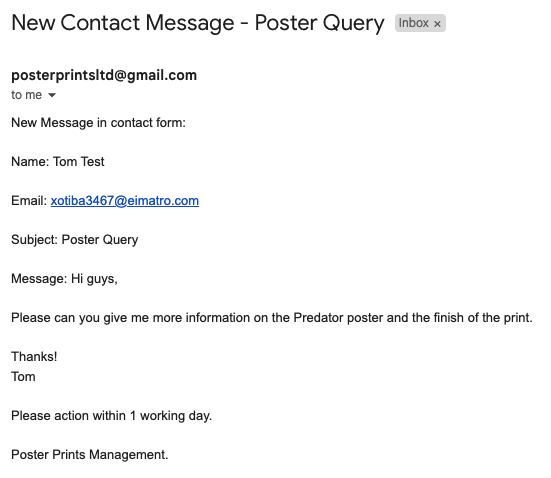
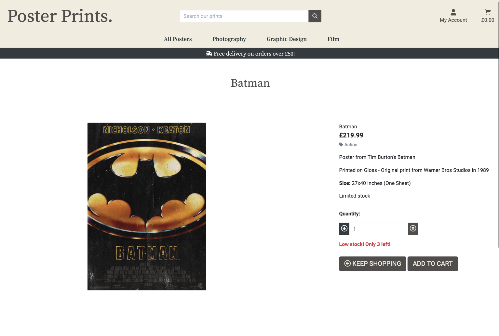
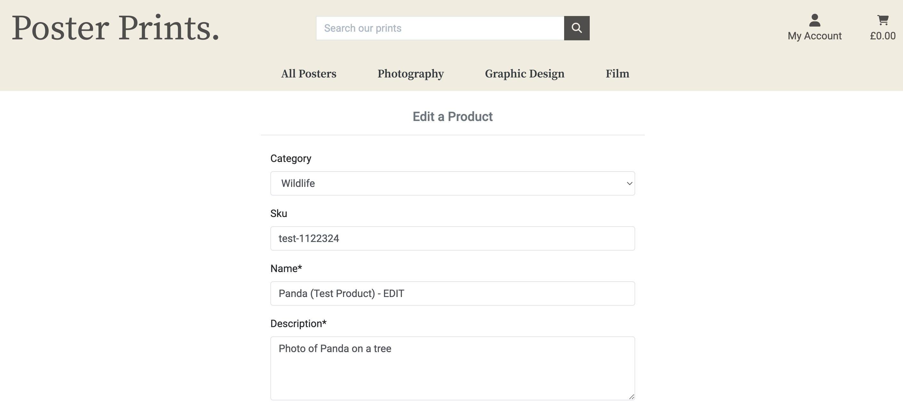
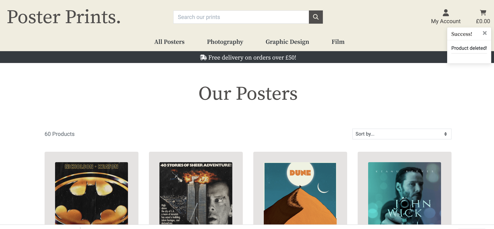
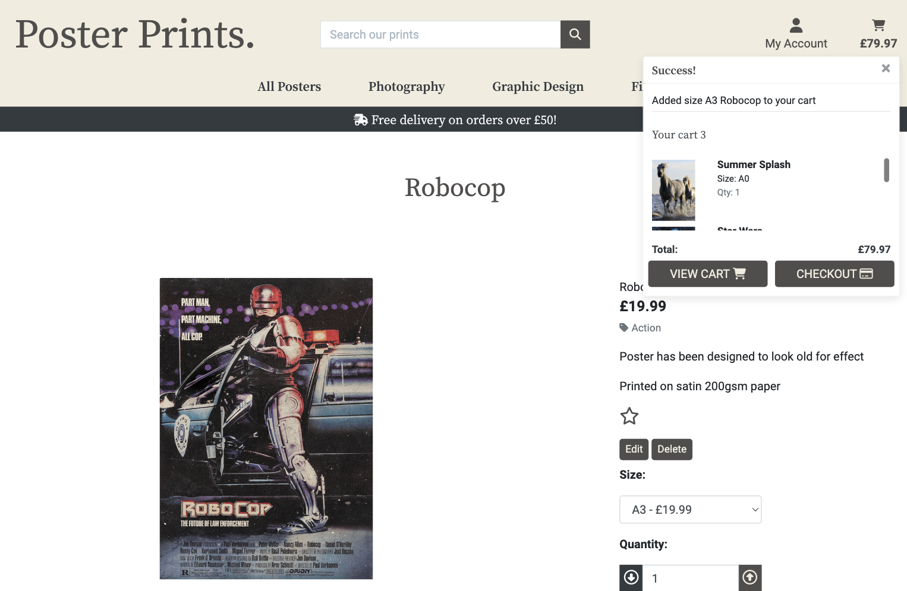

# Poster Prints
Developer: Jamie Letts


[Live webpage](https://poster-prints-8ff329d79ba2.herokuapp.com/)

Poster Prints is an ecommerce poster website allowing users to purchase printed, framed and mounted posters developed for Milestone 4 as milestone project 4 as part of the Code Institute - Level 5 Diploma in Software Development course (Full stack).

- There are two types of users
    - An admin(administrator) user account
    - A regular(shopper) user account
    - When making a payment as a regular user, a test credit card of 4242424242424242 has been set up for the card number
    - For the expiry date, cvc and postal code any series of numbers can be used (once they meet the mimimum values)
<br>


## Table of Contents

[Project Overview](#project-overview)

1. [User Experience](#user-experience)
  * [Strategy](#strategy)
    + [Primary Goal](#primary-goal)
  * [Structure](#structure)
    + [Website pages](#website-pages)
    + [Code Structure](#code-structure)
    + [Database](#database)
      - [Physical database model](#physical-database-model)
      - [Models](#models)
        * [User Model](#user-model)
        * [UserProfile Model](#userprofile-model)
        * [Order Model](#order-model)
        * [OrderLineItem Model](#orderlineitem-model)
        * [Favourites Model](#favourites-model)
        * [Product Model](#product-model)
        * [Category Model](#category-model)
        * [Contact Model](#contact-model)
  * [Scope](#scope)
    + [User Stories](#user-stories)
  * [Skeleton](#skeleton)
    + [Wireframes](#wireframes)
  * [Surface](#surface)
    + [Color Palette](#color-palette)
    + [Typography](#typography)
2. [Features](#features)
    * [Consistent Features](#consistent-features)
    * [Main Content Features](#main-content-features)
3. [Technologies Used](#technologies-used)
    * [Languages](#languages)
    * [Databases](#databases)
    * [Frameworks](#frameworks)
    * [Libraries & Packages](#libraries--packages)
    * [Programs](#programs)
4. [Future Implementations](#future-implementations)
5. [Testing](#testing)
6. [Deployment](#deployment)
  * [Amazon Webservices](#amazon-webservices)
  * [Mongo Database](#mongo-database)
  * [Local Deployment](#local-deployment)
  * [Heroku](#heroku)

7. [Credits](#credits)

10. [Content](#content)

11. [Media](#media)

12. [Acknowledgements](#acknowledgements)

# Project Overview

- This project is a website is for submission as milestone project 4 as part of the Code Institute - Level 5 Diploma in Software Development course (Full Stack).
- The repository on GitHub that contains the website source code and assets is available at the following url: [Code Repository](https://github.com/jamie2210/CI_MS4_PP)
- The website was built to be responsive on desktop, tablet and mobile devices.

# User Experience

## Strategy
_ _ _

### Primary Goal
The primary goal of the website from the site 
owners perspective is as follows:
- To add, edit and delete products with the relevant information (price, description, image, sizes, stock and category) on the website 
- To allow a user make a purchase of the posters on the website
- To display low stocked items
- Allow the user an easy means of contact

The primary goal of the website from a site users perspective is as follows:
- To register for an account on the website and receive an email after successful registration
- To login or logout from the website
- To easily recover my password in case I forget it
- Have a personalised user profile with my delivery, payment information and order history
- View a list of products on the website
- View an individual product detail (price, description, image, sizes, stock (if low) and category)
- To add an item to a shopping bag, and select the quantity and size if applicable
- Complete a purchase of items in a shopping bag
- To sort the list of available products by price and category
- Search for a product by name or description and view the search results
- To have a list of product favourites and to add/delete items from the list


## Structure
_ _ _

### Website Pages
- I have structured the website into mulitple pages, each with clear, concise structure, information and purpose. Bootstrap is used throughout, which provides a consistent structure and responsive design.
- Below are the main page's / features and functionality, there are some others for password reset / verification etc. generated by Alluath. More detail on these in the user stories section.  
- All pages have a common look and feel and a common header/footer. On a tablet/mobile the look and feel is slightly different with a burger menu
- These pages are described in more detail in the user stories section

Page            |Description
:-------------         |:------------- 
Home     | The homepage consists of a single image and call to action 'View Gallery' button  
Contact         | Users can easily contact the store via the contact form which sends the message to django admin, an email to the user as well as the store email address for notification 
Products           | The products page displays the posters in random order unless specifically selected (by price, category etc)  
Product Detail           | The product detail page displays the poster image, description, price, size options (if applicable), quantity selector, add to bag buttons and favourites icon (star)    
Product Management(Add Product)     | A product can be added to the website    
Product Management(Edit Product)     | A product can be edited to the website     
Product Management(Delete Product)     | A product can be deleted from the website. This is a modal triggered by a delete button
Favourites     | A user can add posters to their own favourites list   
Add to Favourites     | Posters can be added or removed to/from a users favourite list by clicking on the star icon on the product detail page      
My Profile             | The users profile (delivery information) and previous orders is displayed       
Order History         | An order history page, order details, the order information and price
Register               | A user can register an account on the site with a valid email address
Login               | A user can login with a valid username and password  
Logout               | A logout button is provided under the My Account link to logout    
Bag | A user can add products to a shopping cart which contains each item in the order and an overall price / delivery if applicable   
Checkout | A user can enter their delivery details and credit card information to checkout an order   
Checkout success | Once an order is successful, the user can view the checkout success

### Code Structure
_ _ _

The project is divided into a number of apps, it is built using the Django Framework
The project was built on the Boutique Ado project with Code Institute, that was part of the project content
The apps are described as follows:
- bag: (part of the original Boutique Ado project): This app contains functionality regarding a users shopping bag
- checkout: (part of the original Boutique Ado project): This app contains functionality regarding a users checking out and payment of an order
- contact: A newly written app, it allows any user, logged in or not, to contact the store with any queries they may have
- favourites: A newly written app, that allows the user to add and remove items from a favourites list. This list is unique to the user.
- home: (part of the original Boutique Ado project): This app contains functionality regarding the users home page
- products: (part of the original Boutique Ado project): This app contains functionality regarding a product.
- profiles: (part of the original Boutique Ado project): This app contains functionality regarding a users profile and order history

To complement the apps there are
- poster_prints: Containing settings.py(Settings) and urls.py(Website urls) for example
- templates: Containing the base.html, allauth(django authentication) and includes html files
- static: Base css and Javascript files, favicon image There is some javascript in some html files, but I have tried to minimise that using separate js files throughout
- manage.py: Main python file for starting the website
- README.md: Readme documentation
- TESTING.md: Testing documentation
- Procfile: To run the application
- Requirements.txt: Containing the python libraries installed
<br>

__Note:__ 
- Environment variable values are not exposed in the source code, they are stored locally in env.py that is not checked in and listed in .gitignore, and on Heroku in app settings.
- I accidentilly committed and pushed an exposed Elephant SQL code so I deleted that database and created a new one making the exposed code redundant.

### Database
_ _ _

- The website is a data-centric one with html, javascript, css used with the bootstrap(version 4) framework as a frontend
- The backend consists of Python built with the Django framework with a database of a Postgres using Elephant SQL for the deployed Heroku version(production)
- Postgres is a powerful, open source object-relational database system (https://www.postgresql.org/)
- A SQLLite database was used for local development (https://www.sqlite.org/index.html)

#### Physical database model
This model contains all fields stored in the database collections with their data type and mimics the structure of what is actually stored in the Postgres database
<br>

#### Models
_ _ _ 

##### User Model
- The User model contains information about the user. It is part of the Django allauth library
- The model contains the following fields: username, password, first_name, last_name, email, is_staff, is_active, is_superuser, last_login, date_joined

##### UserProfile Model
- The UserProfile model has a one-to-one relationship with User
- The model contains the following fields: default_full_name, default_email, default_phone_number, default_street_address1, default_street_address2
default_town_or_city, default_county, default_postcode and default_country

##### Order Model
- The Order model contains information about orders made on the website.
- It contains UserProfile as a foreign-key.
- The model contains the following fields: order_number, user_profile, full_name, email, phone_number, country, postcode, town_or_city, street_address1, street_address2, county, date, delivery_cost, order_total, grand_total, original_bag, stripe_pid

##### OrderLineItem Model
- The OrderLineItem model contains information about an entry in an order, for orders made on the website.
- It contains Order and Product as foreign-keys.
- The model contains the following fields: order, product, product_size, quantity, lineitem_total

##### Favourites Model
- The Favourites model contains a users favourite products
- It contains Products as many-to-many field, and User as a one-to-one relationship
- The model contains the following fields: products, username

##### Product Model
- The Product Model represents a poster and its details
- It contains Category as a foreign-key
- The model contains the following fields: name, category, sku, description, feature, feature2, feature3, unique_size, stock, has_sizes, price, a4_price, a3_price, a2_price, a1_price, a0_price image_url, image, image2_url, image2
- The image fields contains the poster image(s)
- The image_url field contains the url to where the image file is physically stored, for example AWS S3 bucket

##### Category Model
- The Category model contains a product category
- The model contains the following fields: name, friendly_name

##### Contact Model
- The Contact model presents a contact form
- The model contains the following fields: contact_name, contact_email, contact_phone_number, contact_subject, contact_message, date, replied


## Scope
_ _ _
### User Stories


| **Viewing & Navigation** |
|-------------|

| **ID** | **As A** | **I Want To Be Able To** | **So That I Can** |
|-------------|------------|---------------------|-------------------|
| 1 | Shopper | View a list of products | Select some to purchase |
| 2 | Shopper | View specific category of products | Quickly find posters I'm interested in without having to search through all options |
| 3 | Shopper | View Individual product details | Identify the price, description, product rating, product image and available sizes |
| 4 | Shopper | Identify stock levels on items low on stock | Insure I don't miss out on items I want |
| 5 | Shopper | Easily view the total of my purchases at any time | Avoid spending too much |
| 6 | Shopper | Easily contact the store whether I have an account or not | Have an query answered |

| **Registration & User Accounts** |
|-------------|

| **ID** | **As A** | **I Want To Be Able To** | **So That I Can** |
|-------------|------------|---------------------|-------------------|
| 7 | Site User | Easily register for an account | Have a personal account and be able to view my profile |
| 8 | Site User | Easily login or logout | Access my personal account information |
| 9 | Site User | Easily recover my password incase I forget it | Recover access to my account |
| 10 | Site User | Receive confimation after registering  | Verify that my account registration was successful |
| 11 | Site User | Have a personalised user profile | View my personal order history and order confirmations, and save my payment information |

| **Sorting & Searching** |
|-------------|

| **ID** | **As A** | **I Want To Be Able To** | **So That I Can** |
|-------------|------------|---------------------|-------------------|
| 12 | Shopper | Store and view my favourite posters | Easily find them when I am ready to purchase |
| 13 | Shopper | Sort the list of available posters | Easily identify the best priced and categorically sorted products |
| 14 | Shopper | Sort a specific category of poster | Find the best-priced or in a specific category, or sort the products in that category by name |
| 15 | Shopper | Sort multiple categories of products simultaneously | Find the best-priced across the broad categories, such as 'photography' or 'illustrations' |
| 16 | Shopper | Search for a poster by name or description | Find a specific product I'd like to purchase |
| 17 | Shopper | Easily see what I've searched for and the number of results | Quickly decide whether the product I want is available |

| **Purchasing & Checkout** |
|-------------|

| **ID** | **As A** | **I Want To Be Able To** | **So That I Can** |
|-------------|------------|---------------------|-------------------|
| 18 | Shopper | Easily select the size and quantity of a poster when purchasing it | Ensure I don't accidentally select the wrong poster, quantity or size  |
| 19 | Shopper | View items in my bag to purchase | Identify the total cost of my purchase and all items I will receive  |
| 20 | Shopper | Adjust the quantity of individual items in my bag | Easily make changes to my purchases before checkout |
| 21 | Shopper | Easily enter my payment information | Check out quickly and with no hassles |
| 22 | Shopper | Feel my personal payment information is safe and secure | Confidently provide the needed information to make a purchase |
| 23 | Shopper | View an order confirmation after checkout | Verify that I haven't made any mistakes |
| 24 | Shopper | Receive an email confimation after checking out | Keep the confimation of what I've purchased for my records |

| **Admin & Store Management** |
|-------------|

| **ID** | **As A** | **I Want To Be Able To** | **So That I Can** |
|-------------|------------|---------------------|-------------------|
| 25 | Store Owner | Add a poster | Upload new posters for sale to my store |
| 26 | Store Owner | Edit/Update a poster | Change product prices, descriptions, sizes, images, stock and other product criteria |
| 27 | Store Owner | Delete a poster | Remove posters that are no longer for sale |
| 28 | Store Owner | Ensure any errors direct the user back to the home page | Ensure I do not lose them as a customer |


## Skeleton
_ _ _

### Wireframes
Each wireframe image below contains three sub images, one for desktop, tablet and mobile
Balsamiq was used to create the wireframes
_ _ _

<details><summary>Home</summary>

</details>
<details><summary>Register</summary>

</details>
<details><summary>Login</summary>

</details>
<details><summary>Logout</summary>

</details>
<details><summary>Products</summary>

</details>
<details><summary>Products Add</summary>

</details>
<details><summary>Products Edit</summary>

</details>
<details><summary>Products Detail</summary>

</details>
<details><summary>Favourites</summary>

</details>
<details><summary>Cart</summary>

</details>
<details><summary>Checkout</summary>

</details>
<details><summary>Checkout Success</summary>

</details>
<details><summary>Profile</summary>

</details>
<details><summary>Contact</summary>

</details>
<details><summary>Errors</summary>

</details>


## Surface
_ _ _

### Color Palette
As posters are bought on their visual appeal I wanted to ensure they real;ly stood out against the rest of the website. It was important to me to create and warm and gentle design with sublte and calm colours and please fonts. The colours chosen are light and complement each other, none are vibrant or too strong ensuring the imagery of each poster is always the most eye catching.

There are 4 primary colours in the color palette
- 504e4d - Dark grey used for the majority of text on the website.
- f0eddf - The main light shade of yellow / cream used throughout.
- eee9cc - A slight lighter tone of a similar yellow / cream for text.
- e5e3e2 - A sublte purple / grey used for the padding on the poster gallerys which also matches the wall on the home page image.


I feel the colours create the desired effect, making the webite warm and inviting and allowing the posters to really stand out.


### Typography
Noto Serif is used through as the brands main font, 'Roboto' used throughout for the main text font. Both have a fallback of 'sans-serif'.

<details><summary>Noto Serif</summary>

</details>
<details><summary>Roboto</summary>

</details>


# Features

_ _ _

The website has 16 distinct features, and they are described below
Pages are accessible by the 3 types of users
1. A user not logged into the site
2. A regular(shopper) user logged into the site
3. An admin(administrator) user
The navigation buttons update depending on whether a user is logged in or not, and whether that user is the admin:

 Nav Link              |Not logged in  |Logged in as regular user|Logged in as admin
:-------------         |:------------- |:----------------|:------------- |
Home     |&#9989;        |&#9989;          |&#9989; |
Contact         |&#9989;         |&#9989;          |&#9989; |
Register               |&#9989;        |&#10060;         |&#10060; |
Login               |&#9989;        |&#10060;         |&#10060; |
Logout               |&#10060;       |&#9989;          |&#9989; |
Products           |&#9989;        |&#9989;          |&#9989; |
Product Detail           |&#9989;        |&#9989;          |&#9989; |
Product Management(Add Product)     |&#10060;       |&#10060;         |&#9989; |
Product Management(Edit Product)     |&#10060;       |&#10060;         |&#9989; |
Product Management(Delete Product)     |&#10060;       |&#10060;         |&#9989; |
Favourites     |&#10060;       |&#9989;         |&#9989; |
Add to Favourites     |&#10060;       |&#9989;        |&#9989; |
Bag |&#9989;        |&#9989;          |&#9989; |
Checkout |&#9989;        |&#9989;          |&#9989; |
Checkout success |&#9989;        |&#9989;          |&#9989; |
Profile & Order History            |&#10060;       |&#9989;          |&#9989; |


__Defensive Programming__

Defenisve programming is used throughout to prevent users accessing pages they do not have the permission to do so. For areas accessible only for admin checks are made and if the user is not a superuser they will be redirected automatically with a message displayed explaining the action. Should a user not be logged in and try to access a page for logged in users, 'My Favourites' for example, the same will happen with a similar message alerted.

<details><summary>Access Denied</summary>

</details>
<br>

__Stock Management__

For stocked items checks have been made adding items to the bag and editting them agai oncein the bag. Quantity levels above the stock count will not be updated and a message will alert the user of the stock count. If stock is 3 or below a low stock message is displayed with the stock count in the product detail page allowing the user to act fast should the poster be close to out of stock. On purchasing a stocked item the quantity is adjusted depending on the quantity bought. This means there is potential for a low stocked item to be in multiple bags which could lead to upsetting the shopper. Due to time constraints I haven't had time to look into this further but one option would be to put a time limit on a low stocked item once it's in the bag before removing it from the bag if time ran out. It is something I would love to figure out given more time.

<details><summary>Stock Alert</summary>

</details>
<br>

__Features I would like__

With more time I would look into adding more stocked items and a larger viariety of displays including landscape posters with an option to search for landscape or portrait posters. Instead of using an 'up-to-top' button pagination could be used when items get to a certain number to avoid endlessly scrolling when the numbers are really high. For this project as the numbers are limited paired with the option to search by category it works well as it is. I would have also added a review and potentially a comment section but due to the time constraints I focused on adding a favourites page as I saw that as a more important feature. It was also new to me which encouraged me to learn more as a rating feature is included in the Boutique Ado walk through and I used pagination and a comment feature in my 3rd project.
_ _ _

### Consistent Features
_ _ _

* __Favicon__ 

- I designed the favicon in Illustrator.

  

* __Navbar__ 

- The Navbar is displayed on all pages and has a drop down menu with the list changing depending whether logged in or out and whether a shopper or admin.
- The Cart and the items in it are always displayed for easy access.
- Within the Navbar are links to the different categories of posters and a search bar.
- On larger screens the logo acts as a home link which is pushed inside a dropdown menu on smaller screens. 
- The Navbar alters depending on the the device used and a burger bar icon is used to display a dropdown of options on smaller devices and mobiles.

  Logged Out Navbar
  - Log In, Register, Home, Gallery View, Category Options and Cart links
  - User Stories covered: 1, 2, 5, 7, 11, 14, 16, 17 19

  

  Logged In Navbar, Shopper
  - Log In, Register, Home, Gallery View, Category Options, My Favourites, My Profile and Cart links
  - User Stories covered: 1, 2, 5, 7, 11, 12, 14, 16, 17, 19

  

  Logged In Navbar, Admin
  - Log In, Register, Home, Gallery View, Category Options, My Favourites, My Profile, Manage Items and Cart links
  - User Stories covered: 1, 2, 5, 7, 11, 12, 14, 16, 19, 25

  

  Mobile Display

  


* __Footer__ 

- The footer is displayed on all pages and includes social links, my GitHub link to this repository, contact details and a link to the contact page, the copyright year, and payment information.
- It changes from a horizontal list to a vertical one depending on the screen size.
- User Stories covered: 6

  
  
  <details><summary>Mobile Footer</summary>
  
  </details>

* __HomePage__

- Home page consists of a welcome message and button that links to view the entire gallery of posters.
- User Stories covered: 1

  


### Contact
_ _ _

- Contact can be made logged in or out. 
- If logged in and the user has saved their details to their profile, some fields are automatically populated.
- User Stories covered: 6

- Logged out user:

  

- Logged in user:

  

- User Fills out the required fields:

  

- Upon pressing send 5 events are actioned:
  * The query is sent to the admin backend as a form with a boolean field 'Replied' as false. This is to be marked as True once replied to keep organised.
  * The page refreshes to the contact_success page notifying the message has been sent successfully.
  * A success toast messages also confirms the same.
  * An email is sent to the user with a confirmation of what was sent in the message.
  * An emailis sent to the website email notifying the shop owner / staff of a new enquiry prompting action.

- Admin Backend:

  

- Contact Success & Toast:

  

- User Email:

  

- Shop Owner / Staff email:

  


### Register
_ _ _

- To register an account a few steps must be made that verifies the user's email address before permitting the account.
- User Stories covered: 7, 10

- Fill out the Sign Up form:

  

- Receive a prompt top verify email:

  

- Click link in verification email:

  

- Click confirm button:

  

- Email confirmation confirmed with success toast message and prompt to sign in:

  


### Login
_ _ _

- Users log in via the 'My Account' icon dropdown menu in the navbar.
- Once logged in they then have access to their favourites and profile via the same icon dropdown menu.
- User stories covered:  8, 11, 12

- Click Log In:

    

- Fill out Sign In form:

  

- Signed in confirmation toast:

    

- Access logged in features:

  


### Log out
_ _ _

- Users log out via the 'My Account' icon dropdown menu in the navbar
- Userstories covered: 8

- Click Logout:

  

- Confirm Logout:

  

- User returned to home page with logout toast confirmation:

  


### Password Recovery / Reset
_ _ _

- User can recover their password if forgotten
- User stories: 9

- Click 'Forgotten Password?' link:

  

- Confirm email on the account:

  

- Page confirms an email has been sent:

  

- Email sent with reset link:

  

- Enter New Password:

  

- New password confirmation page and toast:

  


### Products
_ _ _

- All posters can be viewed by any user whether logged in or out.
- Categories are listed in the navbar for easy access as well as a search bar.
- Sorting posters by various feilds is also an option.
- the 'All Products' view is randomised to ensure users are always offered something new to encourage new purchases.
- A banner is displayed advertising the free delivery threshold.
- User stories covered: 1, 2, 13, 14, 15, 16, 17

- All posters page and the options for sorting, search and categorising:

  


### Product Detail
_ _ _

- Any user can access the product detail page by clicking on the poster of choice.
- when the mouse hovers over the poster it increases insize highlighting the selection if clicked.
- On the product detail page the following is displayed:
  * If the item has a second image it is diplayed, otherwise the same image is
  * The Title
  * The price
  * Descriptions
  * Size or size options if available
  * Add to Favourites option if logged in
  * Quantity options
  * Call to action if low on stock
  * 'Add To Cart' button

- User stories covered: 3, 4, 12, 18

- Stocked Item:

  

- Item By Size:

  

- Favourites Option (Logged in user)

  


### Product Management(Add Product)
_ _ _

- Admin can add new products on the Product Management page
- On saving user is taken to the new products detail page and a toast confirms the product has been added.
- User stories covered: 25

- Add Product Details:

  

- Save & Create Product:

  


### Product Management(Edit Product)
_ _ _

- Admin can access the Edit Products page using the edit button
- On saving user is taken to the edited products detail page and a toast confirms the product has been updated.
- User stories covered: 26

- Edit Button:

  

- Edit Product Details:

  

- Save & Update Product:

  


### Product Management(Delete Product)
_ _ _

- Admin can delete products using the delete button
- The button calls a modal which confirms whether the user wants to delte the product.
- Toast message confirms the product is deleted once actioned and urser returned to the All Products page
- User Stories covered: 27

- Delete Button:

  

- Delete Modal:

  

- Product Deleted:

  


### Favourites & Add To Favourites
_ _ _

- Logged in users have access to adding and removing prosters from their favourites and a favourites page.
- On the product detail page:
  * Clicking the empty star icon adds the poster from the favourites page.
  * On click the star becomes filled indicating the poster is in favourites and a toast confirms it so also.
  * Clicking the filled star icon removes the poster from the favourites page.
  * On click the star becomes empty indicating the poster is removed from favourites and a toast confirms it so also.
- Access to the favourites page is via the 'My Account' drop down menu in the navbar.
- All favourited posters are listed on the favourites page and can be removed there too.
- User stories covered: 12

- Add to Favourites:

  

- Added To Favourites:

  

- Remove from Favourites:

  

- Removed from Favourites:

  

- Favourites Page:

  

- Favourites Page Remove Modal:

  


### Bag
_ _ _

- All users, logged in or out, can add products the bag.
- Each time a products is added the total is calculated and displayed under icon.
- On clicking the icon the user is taken to the bag page (Shopping Cart on the site)
- From there items can be removed or quantity updated each time confirming with toats message
- There is a Grand Total and button to the secure checkout under the bag items
- User Stories Covered: 5, 18, 19, 20

- Add product to Cart:

  

- View Shopping Cart:

  

- Update Quantity:

  

- Remove Product:

  

- Grand Total / Secure Checkout:

  


### Checkout
_ _ _

- Users Logged in or out can Checkout.
- Users logged in can save their delivery information.
- If a returning user with saved information, delivery details are populated.
- Order details are listed on the right of the delivery information.
- Payment is made via stripe.
- User Stories Covered: 5, 21, 22

- Checkout Page:

  


### Checkout success
_ _ _

- Upon successful checkout a confimation email is sent detailing the order.
- Checkout success page and toast message notifies the user the purchase has been successful. 
- If a user is logged in, the order is stored to their profile. 
- User Stories covered: 22, 23, 24 

- Checkout Success:

  

- Order Confirmation:

  


### Profile & Order History
_ _ _

- Once an account is created as is a profile. 
- The user can save their delivery details there and view their order history.

- User Stories Covered: 11

- User Profile:

  

### Error Pages
_ _ _

- All error pages direct the user back to the home page via a home button
- User Stories covered: 28

- Error Page:

  


## __Technologies Used__
_ _ _

## Languages
- [HTML](https://en.wikipedia.org/wiki/HTML)
- [CSS](https://en.wikipedia.org/wiki/CSS)
- [Javascript](https://www.javascript.com/)
- [Python](https://www.python.org/)

### Databases

- sqlite3 for development.
- [ElephantSQL](https://www.elephantsql.com/)
- [AWS S3](https://aws.amazon.com/s3/) - Services that provides object storage through a web service interface.

### Frameworks

- [Django](https://www.djangoproject.com/) - Version 3.2.16 - A ython web framework for pragmatic design.
- [Bootstrap](https://getbootstrap.com/docs/4.6/getting-started/introduction/) -- A framework for building responsive, mobile-first sites.

### Libraries & Packages

- [jQuery](https://jquery.com/) - Version 3.6.2 - A JavaScript Framework
- [Font Awesome](https://fontawesome.com/)
- [Django Allauth](https://django-allauth.readthedocs.io/en/latest/) - Version 0.41.0 - Used for authentication, registration & account management.
- [django-countries](https://pypi.org/project/django-countries/7.2.1/)
- [django_crispy_forms](https://pypi.org/project/django-crispy-forms/) - provides a tag and filter that lets you quickly render forms
- [gunicorn](https://pypi.org/project/gunicorn/) - a Python WSGI HTTP Server
- [pillow](https://pypi.org/project/Pillow/) - Python imaging library
- [dj_databsae_url](https://pypi.org/project/dj-database-url/) - allows us to utilise the DATABASE_URL variable
- [psycopg2](https://pypi.org/project/psycopg2/) - a postgres database adapter which allow us to connect with a postgres database
- [django-storages](https://pypi.org/project/django-storages/) - a storage backend library
- [boto3](https://pypi.org/project/boto3/) - Allows connection to AWS S3 bucket

### Programs

- [Pip](https://pypi.org/project/pip/) - Tool for installing python packages.
- [Balsamiq](https://balsamiq.com/) - Used to create wireframes.
- [Git](https://git-scm.com/) - For version control.
- [Github](https://github.com/) - To save and store the files for the website.
- [GitPod](https://www.gitpod.io/) - A cloud development environment.
- [Google Fonts](https://fonts.google.com/) - To import the fonts used on the website.
- [Google Chrome Dev Tools](https://developer.chrome.com/docs/devtools/) - To troubleshoot and test features, solve issues with responsiveness and styling.
- [Tiny PNG](https://tinypng.com/) To compress images for use in the readme.
- [Visual Studio Code](https://code.visualstudio.com/) - An integrated development environment from Microsoft.
- [Adobe Suite (Illustrator, Photoshop & InDesign)](https://www.adobe.com/uk/) - Graphic design software.
- [Giphy](https://giphy.com/) - Video to gif conversion website for user story testing section.
- [Font Awesome](https://fontawesome.com/search) - The icons used on the site from font awesome.
- [Quick DBD](https://www.quickdatabasediagrams.com/) - Flow chart maker used for database models.
- [Temp Mail](https://temp-mail.org/en/) - Temporary email account for testing registrations and orders.
- [W3C validator](https://validator.w3.org/) - HTML validation testing.
- [Jigsaw CSS validator](https://jigsaw.w3.org/css-validator/) - CSS validation testing.
- [WAVE Web Accessibility Evaluation Tool](https://wave.webaim.org/) - Accessibility testing.
- [jshint](https://jshint.com/) - Javascript validation testing.
- [pep8](http://ww7.pep8online.com/) - Python validation testing.
- [Chrome Lighthouse](https://developers.google.com/web/tools/lighthouse) - For performance, accessibility, progressive web apps, SEO analysis of the project code.

### Stripe

- [Stripe](https://stripe.com/gb) has been used in the project to implement the payment system.

Stripe for the website is currently in developer mode, which allows the user to be able to process test payments to check the function of the site.

| Type | Card No | Expiry | CVC | ZIP |
| :--- | :--- |:--- | :--- | :--- |
| Success| Visa | 4242 4242 4242 4242 | A date in the future | Any 3 digits | Any 5 digits |
| Require authorisation | 4000 0027 6000 3184 | A date in the future | Any 3 digits | Any 5 digits |
| Declined | 4000 0000 0000 0002 | A date in the future | Any 3 digits | Any 5 digits |


## Testing
_ _ _

The testing information and results for this project are documented in [TESTING.md](TESTING.md)


## APIs & Configuration
_ _ _

### Google emails

To set up the project to send emails and to use a Google account as an SMTP server, the following steps are required
1. Create an email account at google.com, login, navigate to Settings in your gmail account and then click on Other Google Account Settings
2. Turn on 2-step verification and follow the steps to enable
3. Click on app passwords, select Other as the app and give the password a name, for example Django
<br><details><summary>App Password</summary>

</details>

4. Click create and a 16 digit password will be generated, note the password down
5. In the env.py file, create an environment variable called EMAIL_HOST_PASS with the 16 digit password
6. In the env.py file, create an environment variable called EMAIL_HOST_USER with the email address of the gmail account
7. Set and confirm the following values in the settings.py file to successfully send emails
<br><code>EMAIL_BACKEND = 'django.core.mail.backends.smtp.EmailBackend'</code>
<br><code>EMAIL_USE_TLS = True</code>
<br><code>EMAIL_PORT = 587</code>
<br><code>EMAIL_HOST = 'smtp.gmail.com'</code>
<br><code>EMAIL_HOST_USER = os.environ.get('EMAIL_HOST_USER')</code>
<br><code>EMAIL_HOST_PASSWORD = os.environ.get('EMAIL_HOST_PASS')</code>
<br><code>DEFAULT_FROM_EMAIL = os.environ.get('EMAIL_HOST_USER')</code>
8. You will also need to set the variables EMAIL_HOST_PASS and EMAIL_HOST_USER in your production instance, for example Heroku

## Stripe
1. Register for an account at stripe.com
2. Click on the Developers section of your account once logged in
3. Under Developers, click on the API keys section
<br><details><summary>API Keys</summary>

</details>

4. Note the values for the publishable and secret keys
5. In your local environment(env.py) and heroku, create environment variables STRIPE_PUBLIC_KEY and STRIPE_SECRET_KEY with the publishable and secret key values
<br><code>os.environ.setdefault('STRIPE_PUBLIC_KEY', 'YOUR_VALUE_GOES_HERE')</code>
<br><code>os.environ.setdefault('STRIPE_SECRET_KEY', 'YOUR_VALUE_GOES_HERE')</code>

6. Back in the Developers section of your stripe account click on Webhooks
7. Create a webhook with the url of your website <url>/checkout/wh/, for example: https://poster-prints-8ff329d79ba2.herokuapp.com//checkout/wh/
8. Note the secret key created for this webhook
<br><details><summary>Secret Key</summary>

</details>

9. In your local environment(env.py) and heroku, create environment variable STRIPE_WH_SECRET with the secret values
<code>os.environ.setdefault('STRIPE_WH_SECRET', 'YOUR_VALUE_GOES_HERE')</code>

10. Test out the webhook and note the success/fail attempts for troubleshooting

_ _ _

## Deployment

There are a number of applications that need to be configured to run this application locally or on a cloud based service, for example Heroku.

## Amazon WebServices
1. Create an account at aws.amazon.com
2. Open the S3 application and create an S3 bucket named "poster-prints"
3. Uncheck the "Block All Public access setting"
4. In the Properties section, navigate to the "Static Website Hosting" section and click edit
5. Enable the setting, and set the index.html and the error.html values
6. In the Permissions section, click edit on the CORS configuration and set the below configuration
<br><details><summary>AWS CORS</summary>

</details>

7. In the permissions section, click edit on the bucket policy and generate and set the below configuration (or similar to your settings)
<br><details><summary>AWS Bucket Policy</summary>

</details>

8. In the permissions section, click edit on the Access control list(ACL)
9. Set Read access for the Bucket ACL for Everyone(Public Access)
10. The bucket is created, the next step is to open the IAM application to set up access
11. Create a new user group named 'manage-poster-prints'
12. Go to "Policies" and click "Create New Policy"
13. Click "Import Managed Policy" and select "AmazonS3FullAccess" > Click 'Import'.
14. In the JSON editor, update the policy "Resource" to the following
<br><code>"Resource": [</code>
<br><code>"arn:aws:s3:::poster-prints",</code>
<br><code>"arn:aws:s3:::poster-prints/*"</code>
<br><code>]</code>

15. Give the policy a name and click "Create Policy"
16. Add the newly created policy to the user group
<br><details><summary>Added Policy</summary>

</details>

17. Go to Users and create a new user
18. Add the user to the user group manage-poster-prints
19. Select "Programmatic access" for the access type
20. Note the AWS_SECRET_ACCESS_KEY and AWS_ACCESS_KEY_ID variables, they are used in other parts of this README for local deployment and Heroku setup
21. The user is now created with the correct user group and policy
<br><details><summary>User & Policy</summary>

</details>

22. Note the AWS code in settings.py. Note an environment variable called USE_AWS must be set to use these settings, otherwise it will use local storage
<br><details><summary>AWS Settings.py</summary>

</details>

23. These settings set up a cache policy, set the bucket name, and the environment variables AWS_ACCESS_KEY_ID and AWS_SECRET_ACCESS_KEY that you set in your aws account
24. The configuration also requires the media/static folders that must be setup in the AWS S3 bucket to store the media and static files 

### Local Deployment
To run this project locally, you will need to clone the repository
1. Login to GitHub (https://wwww.github.com)
2. Select the repository jamie2210/CI_MS3_PP
3. Click the Code button and copy the HTTPS url, for example: https://github.com/jamie2210/CI_MS4_PP
4. In your IDE, open a terminal and run the git clone command, for example 

    ```git clone https://github.com/jamie2210/CI_MS4_PP```

5. The repository will now be cloned in your workspace
6. Create an env.py file in the root folder in your project, and add in the following code with the relevant key, value pairs, and ensure you enter the correct key values<br>
<code>import os</code><br>
<code>os.environ.setdefault("IP", TO BE ADDED BY USER)</code><br>
<code>os.environ.setdefault("PORT", TO BE ADDED BY USER)</code><br>
<code>os.environ.setdefault("SECRET_KEY", TO BE ADDED BY USER)</code><br>
<code>os.environ.setdefault("MONGO_URI", TO BE ADDED BY USER)</code><br>
<code>os.environ.setdefault("MONGO_DBNAME", TO BE ADDED BY USER)</code><br>
<code>os.environ.setdefault("AWS_ACCESS_KEY_ID", TO BE ADDED BY USER)</code><br>
<code>os.environ.setdefault("AWS_SECRET_ACCESS_KEY", TO BE ADDED BY USER)</code>
7. Install the relevant packages as per the requirements.txt file
8. Start the application by running <code>python3 app.py</code>
9. In the settings.py ensure the connection is set to either the Heroku postgres database or the local sqllite database
10. Ensure debug is set to true in the settings.py file for local development
11. Add localhost/127.0.0.1 to the ALLOWED_HOSTS variable in settings.py
12. Run "python3 manage.py showmigrations" to check the status of the migrations
13. Run "python3 manage.py migrate" to migrate the database
14. Run "python3 manage.py createsuperuser" to create a super/admin user
15. Run "python3 manage.py loaddata categories.json" on the categories file in products/fixtures to create the categories
16. Run "python3 manage.py loaddata products.json" on the products file in products/fixtures to create the products
17. Run "python3 manage.py loaddata news.json" on the news file in news/fixtures to create the news items(optional)
18. Start the application by running <code>python3 manage.py runserver</code>
19. Open the application in a web browser

## Heroku and Postgres Database
To deploy this application to Heroku, run the following steps;
1. Create an account at heroku.com
2. Create an app, give it a name for example poster-prints, and select a region
3. Using ElephantSQL, create an account and the a new instance.    
4. Note the DATABASE_URL, this can be set as an environment variable in your settings.py
5. Install the plugins dj-database-url and psycopg2-binary.
6. Run pip3 freeze > requirements.txt so both are added to the requirements.txt file
7. Create a Procfile with the text: web: gunicorn poster_prints.wsgi:application for example
8. In the settings.py ensure the connection is to the Elephant SQL postgres database and the backend database is commented out
```
# DATABASES = {
 #     'default': {
 #         'ENGINE': 'django.db.backends.sqlite3',
 #         'NAME': os.path.join(BASE_DIR, 'db.sqlite3'),
 #     }
 # }
     
 DATABASES = {
     'default': dj_database_url.parse('your-database-url-here')
 }
 ```
9. Ensure not to commit while the URL is saved in the settings.py file
10. Run "python3 manage.py showmigrations" to check the status of the migrations
11. Run "python3 manage.py migrate" to migrate the database
12. Run "python3 manage.py createsuperuser" to create a super/admin user
13. Run "python3 manage.py loaddata categories.json" on the categories file in products/fixtures to create the categories
14. Run "python3 manage.py loaddata products.json" on the products file in products/fixtures to create the products
15. Install gunicorn and add it to the requirements.tx file using the command pip3 freeze > requirements.txt
16. To confirm the data has been created in hyour Elephant SQL database head to Elephant SQL
17. From there go to browser and select 'auth_user' and select Execute, if succesful you will see the newly created superuser.
<br><details><summary>Super User</summary>

</details>

18. With Elephant database set up, head to Heroku and in add the url to DATABASE_URL in the convig vars.
19. Delete the DATABSES above and replace with
```
if 'DATABASE_URL' in os.environ:
    DATABASES = {
        'default': dj_database_url.parse(os.environ.get('DATABASE_URL'))
    }
else:
    DATABASES = {
        'default': {
            'ENGINE': 'django.db.backends.sqlite3',
            'NAME': os.path.join(BASE_DIR / 'db.sqlite3'),
        }
    }
```
20. From the CLI login to Heroku using the command heroku login -i;
  * Enter your Heroku account email and press Enter.
  * Next, you will be prompted to enter your API key. To obtain your API key, follow these steps:
  * Open the Heroku Dashboard in your web browser and log in with your Heroku account credentials.
  * Navigate to your Account Settings.
  * Scroll down to the API Key section and click on "Reveal" to view your API key.
  * Copy the API key.
  * Return to your terminal or command prompt and paste the API key when prompted.
21. Disable collectstatic in Heroku before any code is pushed using the command heroku config:set DISABLE_COLLECTSTATIC=1 --app
22. Push the code to Heroku using the command git push heroku main
23. Ensure the following environment variables are set in Heroku
<br><details><summary>Config Vars</summary>

</details>

24. Connect the app to GitHub, and enable automatic deploys from main
<br><details><summary>Auto Deploy</summary>

</details>
    
25. Click deploy to deploy your application to Heroku for the first time
26. Click on the link provided to access the application
27. If you encounter any issues accessing the build logs is a good way to troubleshoot the issue

_ _ _

## __Credits__

Button display 
https://stackoverflow.com/questions/26837928/how-can-i-hide-a-button-when-scrolled-to-the-top-of-a-page

arrow button
https://stackoverflow.com/questions/61491765/re-positioning-scroll-to-top-button-when-footer-appears-so-it-never-overlaps
https://stackoverflow.com/questions/18053326/how-to-prevent-fixed-button-from-overlapping-footer-area-and-stop-the-button-on

* [Materialize](https://materializecss.com/) is used throughout for CSS styling and some javascript / jquery

* For Help with using AWS S3 buckets and python these were all very useful;

    https://towardsdatascience.com/how-to-upload-and-download-files-from-aws-s3-using-python-2022-4c9b787b15f2

    https://www.twilio.com/blog/media-file-storage-python-flask-amazon-s3-buckets

    https://blog.filestack.com/tutorials/upload-files-amazon-s3-bucket-using-python/

    https://www.youtube.com/watch?v=QSvw50mMQaQ

    https://www.youtube.com/watch?v=7gqvV4tUxmY

*   When adding a password confirmation Javascript feature that only enables the register button once both password entries are the same, this tutorial was very helpful;

    https://www.youtube.com/watch?v=n5E_gxkLo6A

*  For the pagination of the reviews these articles were of great help;

    https://gist.github.com/mozillazg/69fb40067ae6d80386e10e105e6803c9

    https://pythonhosted.org/Flask-paginate/

    and these tutorials;

    https://www.youtube.com/watch?v=CnBYLXA9zXY

    https://www.youtube.com/watch?v=PSWf2TjTGNY&t=61s

* For the send-email functionality I used some code from the code institute learning platform.

* I used this stack overflow page to better understand exception handling;

  https://stackoverflow.com/questions/33239308/how-to-get-exception-message-in-python-properly

* For a better understanding on how to check for YouTube links in javascript I used this stack overflow thread;

  https://stackoverflow.com/questions/28735459/how-to-validate-youtube-url-in-client-side-in-text-box

_ _ _

## __Content__

- [Font Awesome](#http://fontawesome.com)    
    - The icons used on the site from font awesome.
    
- Fonts<br>
    [Merriweather-sans](#https://fonts.google.com/specimen/Merriweather+Sans)    
    - The text font Merriweather Sans is from Google fonts
  
  [PhillySans](#https://www.dafont.com/philly-sans.font)
    - PhillySans was taken as a free font for personal use from dafont.

_ _ _ 

## __Media__

All images are either photos taken by me or uploaded by users of the site

All logos are designed by myself

_ _ _

## __Acknowledgements__

I would like to take the opportunity to thank;

- My mentor, Mo Shami, for his excellent feedback, advice support and guidance throughout.
- Tutor support from Code Institute for their swift response.
- The slack community of coders for immediate and helpful response.
- WAES College and my Tutor Michael for their support and help throughout.
- My friends and family who have created accounts and tested the site and given valid feedback helping me fix bugs I was otherwise unaware of.