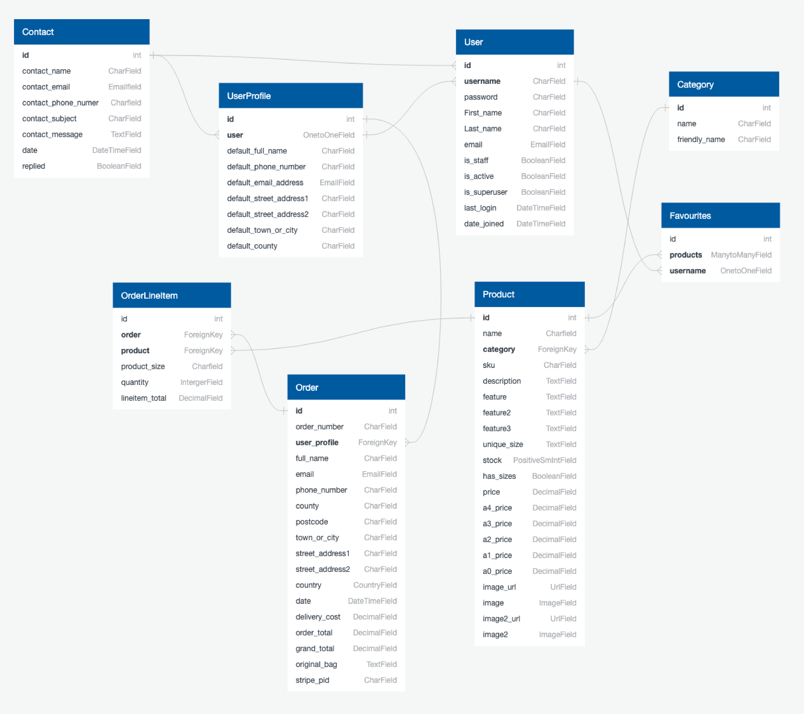

# Poster Prints
Developer: Jamie Letts


[Live webpage](https://poster-prints-8ff329d79ba2.herokuapp.com/)

Poster Prints is an ecommerce poster website allowing users to purchase printed, framed and mounted posters developed for Milestone 4 as milestone project 4 as part of the Code Institute - Level 5 Diploma in Software Development course (Full stack).

- There are two types of users
    - An admin(administrator) user account
    - A regular(shopper) user account
    - When making a payment as a regular user, a test credit card of 4242424242424242 has been set up for the card number
    - For the expiry date, cvc and postal code any series of numbers can be used (once they meet the mimimum values)
<br>


## Table of Contents

[Project Overview](#project-overview)

1. [User Experience](#user-experience)
  * [Strategy](#strategy)
    + [Primary Goal](#primary-goal)
  * [Structure](#structure)
    + [Website pages](#website-pages)
    + [Code Structure](#code-structure)
    + [Database](#database)
      - [Physical database model](#physical-database-model)
      - [Models](#models)
        * [User Model](#user-model)
        * [UserProfile Model](#userprofile-model)
        * [Order Model](#order-model)
        * [OrderLineItem Model](#orderlineitem-model)
        * [Favourites Model](#favourites-model)
        * [Product Model](#product-model)
        * [Category Model](#category-model)
        * [Contact Model](#contact-model)
  * [Scope](#scope)
    + [User Stories](#user-stories)
  * [Skeleton](#skeleton)
    + [Wireframes](#wireframes)
  * [Surface](#surface)
    + [Color Palette](#color-palette)
    + [Typography](#typography)
2. [Features](#features)
    * [Consistent Features](#consistent-features)
    * [Main Content Features](#main-content-features)
3. [Technologies Used](#technologies-used)
    * [Languages](#languages)
    * [Databases](#databases)
    * [Frameworks](#frameworks)
    * [Libraries & Packages](#libraries--packages)
    * [Programs](#programs)
4. [Future Implementations](#future-implementations)
5. [Testing](#testing)
6. [Deployment](#deployment)
  * [Amazon Webservices](#amazon-webservices)
  * [Mongo Database](#mongo-database)
  * [Local Deployment](#local-deployment)
  * [Heroku](#heroku)

7. [Credits](#credits)

10. [Content](#content)

11. [Media](#media)

12. [Acknowledgements](#acknowledgements)

# Project Overview

- This project is a website is for submission as milestone project 4 as part of the Code Institute - Level 5 Diploma in Software Development course (Full Stack).
- The repository on GitHub that contains the website source code and assets is available at the following url: [Code Repository](https://github.com/jamie2210/CI_MS4_PP)
- The website was built to be responsive on desktop, tablet and mobile devices.

# User Experience

## Strategy
_ _ _

### Primary Goal
The primary goal of the website from the site 
owners perspective is as follows:
- To add, edit and delete products with the relevant information (price, description, image, sizes, stock and category) on the website 
- To allow a user make a purchase of the posters on the website
- To display low stocked items
- Allow the user an easy means of contact

The primary goal of the website from a site users perspective is as follows:
- To register for an account on the website and receive an email after successful registration
- To login or logout from the website
- To easily recover my password in case I forget it
- Have a personalised user profile with my delivery, payment information and order history
- View a list of products on the website
- View an individual product detail (price, description, image, sizes, stock (if low) and category)
- To add an item to a shopping bag, and select the quantity and size if applicable
- Complete a purchase of items in a shopping bag
- To sort the list of available products by price and category
- Search for a product by name or description and view the search results
- To have a list of product favourites and to add/delete items from the list
_ _ _

## Structure
_ _ _

### Website Pages
- I have structured the website into mulitple pages, each with clear, concise structure, information and purpose. Bootstrap is used throughout, which provides a consistent structure and responsive design.
- Below are the main page's / features and functionality, there are some others for password reset / verification etc. generated by Alluath. More detail on these in the user stories section.  
- All pages have a common look and feel and a common header/footer. On a tablet/mobile the look and feel is slightly different with a burger menu
- These pages are described in more detail in the user stories section

Page            |Description
:-------------         |:------------- 
Home     | The homepage consists of a single image and call to action 'View Gallery' button  
Contact         | Users can easily contact the store via the contact form which sends the message to django admin, an email to the user as well as the store email address for notification 
Products           | The products page displays the posters in random order unless specifically selected (by price, category etc)  
Product Detail           | The product detail page displays the poster image, description, price, size options (if applicable), quantity selector, add to bag buttons and favourites icon (star)    
Product Management(Add Product)     | A product can be added to the website    
Product Management(Edit Product)     | A product can be edited to the website     
Product Management(Delete Product)     | A product can be deleted from the website. This is a modal triggered by a delete button
Favourites     | A user can add posters to their own favourites list   
Add to Favourites     | Posters can be added or removed to/from a users favourite list by clicking on the star icon on the product detail page      
My Profile             | The users profile (delivery information) and previous orders is displayed       
Order History         | An order history page, order details, the order information and price
Register               | A user can register an account on the site with a valid email address
Log in               | A user can login with a valid username and password  
Log out               | A logout button is provided under the My Account link to logout    
Bag / Cart | A user can add products to a shopping cart which contains each item in the order and an overall price / delivery if applicable   
Checkout | A user can enter their delivery details and credit card information to checkout an order   
Checkout success | Once an order is successful, the user can view the checkout success

### Code Structure
_ _ _

The project is divided into a number of apps, it is built using the Django Framework
The project was built on the Boutique Ado project with Code Institute, that was part of the project content
The apps are described as follows:
- bag: (part of the original Boutique Ado project): This app contains functionality regarding a users shopping bag
- checkout: (part of the original Boutique Ado project): This app contains functionality regarding a users checking out and payment of an order
- contact: A newly written app, it allows any user, logged in or not, to contact the store with any queries they may have
- favourites: A newly written app, that allows the user to add and remove items from a favourites list. This list is unique to the user.
- home: (part of the original Boutique Ado project): This app contains functionality regarding the users home page
- products: (part of the original Boutique Ado project): This app contains functionality regarding a product.
- profiles: (part of the original Boutique Ado project): This app contains functionality regarding a users profile and order history

To complement the apps there are
- poster_prints: Containing settings.py(Settings) and urls.py(Website urls) for example
- templates: Containing the base.html, allauth(django authentication) and includes html files
- static: Base css and Javascript files, favicon image There is some javascript in some html files, but I have tried to minimise that using separate js files throughout
- manage.py: Main python file for starting the website
- README.md: Readme documentation
- TESTING.md: Testing documentation
- Procfile: To run the application
- Requirements.txt: Containing the python libraries installed
<br>

__Note:__ 
- Environment variable values are not exposed in the source code, they are stored locally in env.py that is not checked in and listed in .gitignore, and on Heroku in app settings.
- I accidentilly committed and pushed an exposed Elephant SQL code so I deleted that database and created a new one making the exposed code redundant.

### Database
_ _ _

- The website is a data-centric one with html, javascript, css used with the bootstrap(version 4) framework as a frontend
- The backend consists of Python built with the Django framework with a database of a Postgres using Elephant SQL for the deployed Heroku version(production)
- Postgres is a powerful, open source object-relational database system (https://www.postgresql.org/)
- A SQLLite database was used for local development (https://www.sqlite.org/index.html)

#### Physical database model
This model contains all fields stored in the database collections with their data type and mimics the structure of what is actually stored in the Postgres database
<br>

#### Models
_ _ _ 

##### User Model
- The User model contains information about the user. It is part of the Django allauth library
- The model contains the following fields: username, password, first_name, last_name, email, is_staff, is_active, is_superuser, last_login, date_joined

##### UserProfile Model
- The UserProfile model has a one-to-one relationship with User
- The model contains the following fields: default_full_name, default_email, default_phone_number, default_street_address1, default_street_address2
default_town_or_city, default_county, default_postcode and default_country

##### Order Model
- The Order model contains information about orders made on the website.
- It contains UserProfile as a foreign-key.
- The model contains the following fields: order_number, user_profile, full_name, email, phone_number, country, postcode, town_or_city, street_address1, street_address2, county, date, delivery_cost, order_total, grand_total, original_bag, stripe_pid

##### OrderLineItem Model
- The OrderLineItem model contains information about an entry in an order, for orders made on the website.
- It contains Order and Product as foreign-keys.
- The model contains the following fields: order, product, product_size, quantity, lineitem_total

##### Favourites Model
- The Favourites model contains a users favourite products
- It contains Products as many-to-many field, and User as a one-to-one relationship
- The model contains the following fields: products, username

##### Product Model
- The Product Model represents a poster and its details
- It contains Category as a foreign-key
- The model contains the following fields: name, category, sku, description, feature, feature2, feature3, unique_size, stock, has_sizes, price, a4_price, a3_price, a2_price, a1_price, a0_price image_url, image, image2_url, image2
- The image fields contains the poster image(s)
- The image_url field contains the url to where the image file is physically stored, for example AWS S3 bucket

##### Category Model
- The Category model contains a product category
- The model contains the following fields: name, friendly_name

##### Contact Model
- The Contact model presents a contact form
- The model contains the following fields: contact_name, contact_email, contact_phone_number, contact_subject, contact_message, date, replied
_ _ _

## Scope
_ _ _
### User Stories


| **Viewing & Navigation** |
|-------------|

| **ID** | **As A** | **I Want To Be Able To** | **So That I Can** |
|-------------|------------|---------------------|-------------------|
| 1 | Shopper | View a list of products | Select some to purchase |
| 2 | Shopper | View specific category of products | Quickly find posters I'm interested in without having to search through all options |
| 3 | Shopper | View Individual product details | Identify the price, description, product rating, product image and available sizes |
| 4 | Shopper | Identify stock levels on items low on stock | Insure I don't miss out on items I want |
| 5 | Shopper | Easily view the total of my purchases at any time | Avoid spending too much |
| 6 | Shopper | Easily contact the store whether I have an account or not | Have an query answered |

| **Registration & User Accounts** |
|-------------|

| **ID** | **As A** | **I Want To Be Able To** | **So That I Can** |
|-------------|------------|---------------------|-------------------|
| 7 | Site User | Easily register for an account | Have a personal account and be able to view my profile |
| 8 | Site User | Easily login or logout | Access my personal account information |
| 9 | Site User | Easily recover my password incase I forget it | Recover access to my account |
| 10 | Site User | Receive an email confimation after registering  | Verify that my account registration was successful |
| 11 | Site User | Have a personalised user profile | View my personal order history and order confirmations, and save my payment information |

| **Sorting & Searching** |
|-------------|

| **ID** | **As A** | **I Want To Be Able To** | **So That I Can** |
|-------------|------------|---------------------|-------------------|
| 12 | Shopper | Store and view my favourite posters | Easily find them when I am ready to purchase |
| 13 | Shopper | Sort the list of available posters | Easily identify the best priced and categorically sorted products |
| 14 | Shopper | Sort a specific category of poster | Find the best-priced or in a specific category, or sort the products in that category by name |
| 15 | Shopper | Sort multiple categories of products simultaneously | Find the best-priced across the broad categories, such as 'photography' or 'illustrations' |
| 16 | Shopper | Search for a poster by name or description | Find a specific product I'd like to purchase |
| 17 | Shopper | Easily see what I've searched for and the number of results | Quickly decide whether the product I want is available |

| **Purchasing & Checkout** |
|-------------|

| **ID** | **As A** | **I Want To Be Able To** | **So That I Can** |
|-------------|------------|---------------------|-------------------|
| 18 | Shopper | Easily select the size and quantity of a poster when purchasing it | Ensure I don't accidentally select the wrong poster, quantity or size  |
| 19 | Shopper | View items in my bag to purchased | Identify the total cost of my purchase and all items I will receive  |
| 20 | Shopper | Adjust the quantity of individual items in my bag | Easily make changes to my purchases before checkout |
| 21 | Shopper | Easily enter my payment information | Check out quickly and with no hassles |
| 22 | Shopper | Feel my personal payment information is safe and secure | Confidently provide the needed information to make a purchase |
| 23 | Shopper | View an order confirmation after checkout | Verify that I haven't made any mistakes |
| 24 | Shopper | Receive an email confimation after checking out | Keep the confimation of what I've purchased for my records |

| **Admin & Store Management** |
|-------------|

| **ID** | **As A** | **I Want To Be Able To** | **So That I Can** |
|-------------|------------|---------------------|-------------------|
| 25 | Store Owner | Add a poster | Upload new posters for sale to my store |
| 26 | Store Owner | Edit/Update a poster | Change product prices, descriptions, sizes, images, stock and other product criteria |
| 27 | Store Owner | Delete a poster | Remove posters that are no longer for sale |
_ _ _

## Skeleton
_ _ _

### Wireframes
Each wireframe image below contains three sub images, one for desktop, tablet and mobile
Balsamiq was used to create the wireframes
_ _ _

<details><summary>Home</summary>

</details>
<details><summary>Register</summary>

</details>
<details><summary>Login</summary>

</details>
<details><summary>Logout</summary>

</details>
<details><summary>Products</summary>

</details>
<details><summary>Products Add</summary>

</details>
<details><summary>Products Edit</summary>

</details>
<details><summary>Products Detail</summary>

</details>
<details><summary>Favourites</summary>

</details>
<details><summary>Cart</summary>

</details>
<details><summary>Checkout</summary>

</details>
<details><summary>Checkout Success</summary>

</details>
<details><summary>Profile</summary>

</details>
<details><summary>Contact</summary>

</details>
<details><summary>Errors</summary>

</details>

_ _ _

## Surface
_ _ _

### Color Palette
As posters are bought on their visual appeal I wanted to ensure they real;ly stood out against the rest of the website. It was important to me to create and warm and gentle design with sublte and calm colours and please fonts. The colours chosen are light and complement each other, none are vibrant or too strong ensuring the imagery of each poster is always the most eye catching.

There are 4 primary colours in the color palette
- 504e4d - Dark grey used for the majority of text on the website
- f0eddf - The main light shade of yellow / cream used throughout
- eee9cc - A slight lighter tone of a similar yellow / cream for text
- e5e3e2 - A sublte purple / grey used for the padding on the poster gallerys which also matches the wall on the home page image.


I feel the colours create the desired effect, making the webite warm and inviting and allowing the posters to really stand out.


### Typography
Noto Serif is used through as the brands main font, 'Roboto' used throughout for the main text font. Both have a fallback of 'sans-serif'.

<details><summary>Noto Serif</summary>

</details>
<details><summary>Roboto</summary>

</details>

_ _ _

# Features

_ _ _

The website has 16 distinct features, and they are described below
Pages are accessible by the 3 types of users
1. A user not logged into the site
2. A regular(shopper) user logged into the site
3. An admin(administrator) user
The navigation buttons update depending on whether a user is logged in or not, and whether that user is the admin:

 Nav Link              |Not logged in  |Logged in as regular user|Logged in as admin
:-------------         |:------------- |:----------------|:------------- |
Home     |&#9989;        |&#9989;          |&#9989; |
Contact         |&#9989;         |&#9989;          |&#9989; |
Register               |&#9989;        |&#10060;         |&#10060; |
Log in               |&#9989;        |&#10060;         |&#10060; |
Log out               |&#10060;       |&#9989;          |&#9989; |
Products           |&#9989;        |&#9989;          |&#9989; |
Product Detail           |&#9989;        |&#9989;          |&#9989; |
Product Management(Add Product)     |&#10060;       |&#10060;         |&#9989; |
Product Management(Edit Product)     |&#10060;       |&#10060;         |&#9989; |
Product Management(Delete Product)     |&#10060;       |&#10060;         |&#9989; |
Favourites     |&#10060;       |&#9989;         |&#9989; |
Add to Favourites     |&#10060;       |&#9989;        |&#9989; |
Bag |&#9989;        |&#9989;          |&#9989; |
Checkout |&#9989;        |&#9989;          |&#9989; |
Checkout success |&#9989;        |&#9989;          |&#9989; |
Profile & Order History            |&#10060;       |&#9989;          |&#9989; |

### Consistent Features

* __Favicon__ 

- I designed the favicon in Illustrator.

  

* __Navbar__ 

- The Navbar is displayed on all pages and has a drop down menu with the list changing depending whether logged in or out and whether a shopper or admin.
- The Cart and the items in it are always displayed for easy access.
- Within the Navbar are links to the different categories of posters and a search bar.
- On larger screens the logo acts as a home link which is pushed inside a dropdown menu on smaller screens. 
- The Navbar alters depending on the the device used and a burger bar icon is used to display a dropdown of options on smaller devices and mobiles.

  Logged Out Navbar
  - Log In, Register, Home, Gallery View, Category Options and Cart links
  - User Stories covered: 1, 2, 5, 7, 11, 14, 16, 17 19

  

  Logged In Navbar, Shopper
  - Log In, Register, Home, Gallery View, Category Options, My Favourites, My Profile and Cart links
  - User Stories covered: 1, 2, 5, 7, 11, 12, 14, 16, 17, 19

  

  Logged In Navbar, Admin
  - Log In, Register, Home, Gallery View, Category Options, My Favourites, My Profile, Manage Items and Cart links
  - User Stories covered: 1, 2, 5, 7, 11, 12, 14, 16, 19, 25

  

  Mobile Display

    


* __Footer__ 

- The footer is displayed on all pages and includes social links, my GitHub link to this repository, contact details and a link to the contact page, the copyright year, and payment information.
- It changes from a horizontal list to a vertical one depending on the screen size.
- User Stories covered: 6

  
  
  <details><summary>Mobile Footer</summary>
  
  </details>

* __HomePage__

- Home page consists of a welcome message and button that links to view the entire gallery of posters.
- User Stories covered: 1

  

### __Main Content Features__

There are X pages which extend from a base template;

* __Logged Out Home__
* __Logged In Home__
* __Login__
* __Register__
* __Profile__

### Logged Out Home
- Introduction to the site
- Log In or Register Button
- User redirected here if not logged in
- User Stories covered: 


_ _ _

## __Technologies Used__

_ _ _

## Languages
- [HTML](https://en.wikipedia.org/wiki/HTML)
- [CSS](https://en.wikipedia.org/wiki/CSS)
- [Javascript](https://www.javascript.com/)
- [Python](https://www.python.org/)

### Databases

- sqlite3 for development.
- [ElephantSQL](https://www.elephantsql.com/)
- [AWS S3](https://aws.amazon.com/s3/) - Services that provides object storage through a web service interface.

### Frameworks

- [Django](https://www.djangoproject.com/) - Version 3.2.16 - A ython web framework for pragmatic design.
- [Bootstrap](https://getbootstrap.com/docs/4.6/getting-started/introduction/) -- A framework for building responsive, mobile-first sites.

### Libraries & Packages

- [jQuery](https://jquery.com/) - Version 3.6.2 - A JavaScript Framework
- [Font Awesome](https://fontawesome.com/)
- [Django Allauth](https://django-allauth.readthedocs.io/en/latest/) - Version 0.41.0 - Used for authentication, registration & account management.
- [django-countries](https://pypi.org/project/django-countries/7.2.1/)
- [django_crispy_forms](https://pypi.org/project/django-crispy-forms/) - provides a tag and filter that lets you quickly render forms
- [gunicorn](https://pypi.org/project/gunicorn/) - a Python WSGI HTTP Server
- [pillow](https://pypi.org/project/Pillow/) - Python imaging library
- [dj_databsae_url](https://pypi.org/project/dj-database-url/) - allows us to utilise the DATABASE_URL variable
- [psycopg2](https://pypi.org/project/psycopg2/) - a postgres database adapter which allow us to connect with a postgres database
- [django-storages](https://pypi.org/project/django-storages/) - a storage backend library
- [boto3](https://pypi.org/project/boto3/) - Allows connection to AWS S3 bucket

### Programs

- [Pip](https://pypi.org/project/pip/) - Tool for installing python packages.
- [Balsamiq](https://balsamiq.com/) - Used to create wireframes.
- [Git](https://git-scm.com/) - For version control.
- [Github](https://github.com/) - To save and store the files for the website.
- [GitPod](https://www.gitpod.io/) - A cloud development environment.
- [Google Fonts](https://fonts.google.com/) - To import the fonts used on the website.
- [Google Chrome Dev Tools](https://developer.chrome.com/docs/devtools/) - To troubleshoot and test features, solve issues with responsiveness and styling.
- [Tiny PNG](https://tinypng.com/) To compress images for use in the readme.
- [Visual Studio Code](https://code.visualstudio.com/) - An integrated development environment from Microsoft.
- [Adobe Suite (Illustrator, Photoshop & InDesign)](https://www.adobe.com/uk/) - Graphic design software.
- [Giphy](https://giphy.com/) - Video to gif conversion website for user story testing section.
- [Font Awesome](https://fontawesome.com/search) - The icons used on the site from font awesome.
- [Diagrams.net](https://app.diagrams.net/) - Flow chart maker used for database models.
- [W3C validator](https://validator.w3.org/) - HTML validation testing.
- [Jigsaw CSS validator](https://jigsaw.w3.org/css-validator/) - CSS validation testing.
- [WAVE Web Accessibility Evaluation Tool](https://wave.webaim.org/) - Accessibility testing.
- [jshint](https://jshint.com/) - Javascript validation testing.
- [pep8](http://ww7.pep8online.com/) - Python validation testing.
- [Chrome Lighthouse](https://developers.google.com/web/tools/lighthouse) - For performance, accessibility, progressive web apps, SEO analysis of the project code

### Stripe

- [Stripe](https://stripe.com/gb) has been used in the project to implement the payment system.

Stripe for the website is currently in developer mode, which allows the user to be able to process test payments to check the function of the site.

| Type | Card No | Expiry | CVC | ZIP |
| :--- | :--- |:--- | :--- | :--- |
| Success| Visa | 4242 4242 4242 4242 | A date in the future | Any 3 digits | Any 5 digits |
| Require authorisation | 4000 0027 6000 3184 | A date in the future | Any 3 digits | Any 5 digits |
| Declined | 4000 0000 0000 0002 | A date in the future | Any 3 digits | Any 5 digits |

_ _ _


_ _ _

## __Future Implementations__

I am content with what was implemented but if I had more time there are a few bonus features I think could be added;


## __Testing__

The testing information and results for this project are documented in [TESTING.md](TESTING.md)

_ _ _

## __APIs__

### Email JS
1. Create an account at emailjs.com 
2. In the integration screen in the emailjs dashboard, note your userid
3. Create an email service in the Email Services section and note the id
4. Create an email template in the Email templates section and note the id
5. Update the script sendEmail.js, method sendMail with your user id, email service id and email template id.

_ _ _

## __Deployment__

There are a number of applications that need to be configured to run this application locally or on a cloud based service, for example Heroku

### Amazon WebServices
1. Create an account at https://aws.amazon.com
2. Open the IAM application and create a new user
3. Set the AmazonS3FullAccess for the user and note the users AWS ACCESS and SECRET keys

4. Open the S3 application and create a new bucket. For the purpose of this application the bucket name is rave-reviews-bucket but this can be updated.
5. With security best practices update the public access and policy bucket to enable the user created and the application access to read/write to the S3 bucket. Consult the AWS documentation if required: https://aws.amazon.com/s3/

6. The s3 bucket is now updated to be accessed by your application.
7. In necessary route files update the variables BUCKET and image_url with the correct information that you have set up, for example:
<br>
<code>BUCKET = "rave-reviews-bucket"</code><br>
<code>image_url = "https://rave-reviews-bucket.s3.eu-west-1.amazonaws.com/" </code>


### Mongo Database
Mongodb is the database used in the application
1. Create an account at mongodb
2. Create a database cluster
3. Select the cluster, and in the collections section create a database and create 4 collections under the database: raves, organisation, users & comments.

4. In the database access, create a user and allow the user read/write access. Note the username.
5. In the network access tab, allow network access from the ip-address of the application connecting to the database.
6. In the Databases section click Connect, and select connect your application.
7. Note the MONGO_URI, MONGO_DBNAME and user, these parameters are used when deploying locally(env.py file) and deploying on the likes of heroku(config vars).

### Local Deployment
To run this project locally, you will need to clone the repository.
1. Login to GitHub (https://wwww.github.com).
2. Select the repository jamie2210/CI_MS3_RR.
3. Click the Code button and copy the HTTPS url, for example: https://github.com/jamie2210/CI_MS3_RR
4. In your IDE, open a terminal and run the git clone command, for example 

    ```git clone https://github.com/jamie2210/CI_MS3_RR```

5. The repository will now be cloned in your workspace.
6. Create an env.py file in the root folder in your project, and add in the following code with the relevant key, value pairs, and ensure you enter the correct key values<br>
<code>import os</code><br>
<code>os.environ.setdefault("IP", TO BE ADDED BY USER)</code><br>
<code>os.environ.setdefault("PORT", TO BE ADDED BY USER)</code><br>
<code>os.environ.setdefault("SECRET_KEY", TO BE ADDED BY USER)</code><br>
<code>os.environ.setdefault("MONGO_URI", TO BE ADDED BY USER)</code><br>
<code>os.environ.setdefault("MONGO_DBNAME", TO BE ADDED BY USER)</code><br>
<code>os.environ.setdefault("AWS_ACCESS_KEY_ID", TO BE ADDED BY USER)</code><br>
<code>os.environ.setdefault("AWS_SECRET_ACCESS_KEY", TO BE ADDED BY USER)</code>
7. Install the relevant packages as per the requirements.txt file
8. Start the application by running <code>python3 app.py</code>

### Heroku
To deploy this application to Heroku, run the following steps.
1. In the app.py file, ensure that debug is not enabled, i.e. set to True.
2. Create a file called ProcFile in the root directory, and add the line <code>web: python app.py</code> if the file does not already exist.
3. Create a requirements.txt file by running the command <code>pip freeze > requirements.txt</code> in your terminal if the file doesn't already exist.
5. Both the ProcFile and requirements.txt files should be added to your git repo in the root directory.
6. Create an account on heroku.com.
7. Create a new application and give it a unique name.
8. In the application dashboard, navigate to the deploy section and connect your application to your git repo, by selecting your repo.

9. Select the branch for example master and enable automatic deploys if desired. Otherwise, a deployment will be manual
10. The next step is to set the config variables in the Settings section

11. Set key/value pairs for the following keys: AWS_ACCESS_KEY_ID, AWS_SECRET_ACCESS_KEY, IP, MONGO_DBNAME, MONGO_URI, PORT, SECRET_KEY
12. Go to the dashboard and trigger a deployment

13. This will trigger a deployment, once the deployment has been successful click on the "Open App" link to open the app.
14. If you encounter any issues accessing the build logs is a good way to troubleshoot the issue.

_ _ _

## __Credits__

Button display 
https://stackoverflow.com/questions/26837928/how-can-i-hide-a-button-when-scrolled-to-the-top-of-a-page

arrow button
https://stackoverflow.com/questions/61491765/re-positioning-scroll-to-top-button-when-footer-appears-so-it-never-overlaps
https://stackoverflow.com/questions/18053326/how-to-prevent-fixed-button-from-overlapping-footer-area-and-stop-the-button-on

* [Materialize](https://materializecss.com/) is used throughout for CSS styling and some javascript / jquery

* For Help with using AWS S3 buckets and python these were all very useful;

    https://towardsdatascience.com/how-to-upload-and-download-files-from-aws-s3-using-python-2022-4c9b787b15f2

    https://www.twilio.com/blog/media-file-storage-python-flask-amazon-s3-buckets

    https://blog.filestack.com/tutorials/upload-files-amazon-s3-bucket-using-python/

    https://www.youtube.com/watch?v=QSvw50mMQaQ

    https://www.youtube.com/watch?v=7gqvV4tUxmY

*   When adding a password confirmation Javascript feature that only enables the register button once both password entries are the same, this tutorial was very helpful;

    https://www.youtube.com/watch?v=n5E_gxkLo6A

*  For the pagination of the reviews these articles were of great help;

    https://gist.github.com/mozillazg/69fb40067ae6d80386e10e105e6803c9

    https://pythonhosted.org/Flask-paginate/

    and these tutorials;

    https://www.youtube.com/watch?v=CnBYLXA9zXY

    https://www.youtube.com/watch?v=PSWf2TjTGNY&t=61s

* For the send-email functionality I used some code from the code institute learning platform.

* I used this stack overflow page to better understand exception handling;

  https://stackoverflow.com/questions/33239308/how-to-get-exception-message-in-python-properly

* For a better understanding on how to check for YouTube links in javascript I used this stack overflow thread;

  https://stackoverflow.com/questions/28735459/how-to-validate-youtube-url-in-client-side-in-text-box

_ _ _

## __Content__

- [Font Awesome](#http://fontawesome.com)    
    - The icons used on the site from font awesome.
    
- Fonts<br>
    [Merriweather-sans](#https://fonts.google.com/specimen/Merriweather+Sans)    
    - The text font Merriweather Sans is from Google fonts
  
  [PhillySans](#https://www.dafont.com/philly-sans.font)
    - PhillySans was taken as a free font for personal use from dafont.

_ _ _ 

## __Media__

All images are either photos taken by me or uploaded by users of the site

All logos are designed by myself

_ _ _

## __Acknowledgements__

I would like to take the opportunity to thank;

- My mentor, Mo Shami, for his excellent feedback, advice support and guidance throughout.
- Tutor support from Code Institute for their swift response.
- The slack community of coders for immediate and helpful response.
- WAES College and my Tutor Michael for their support and help throughout.
- My friends and family who have created accounts and tested the site and given valid feedback helping me fix bugs I was otherwise unaware of.