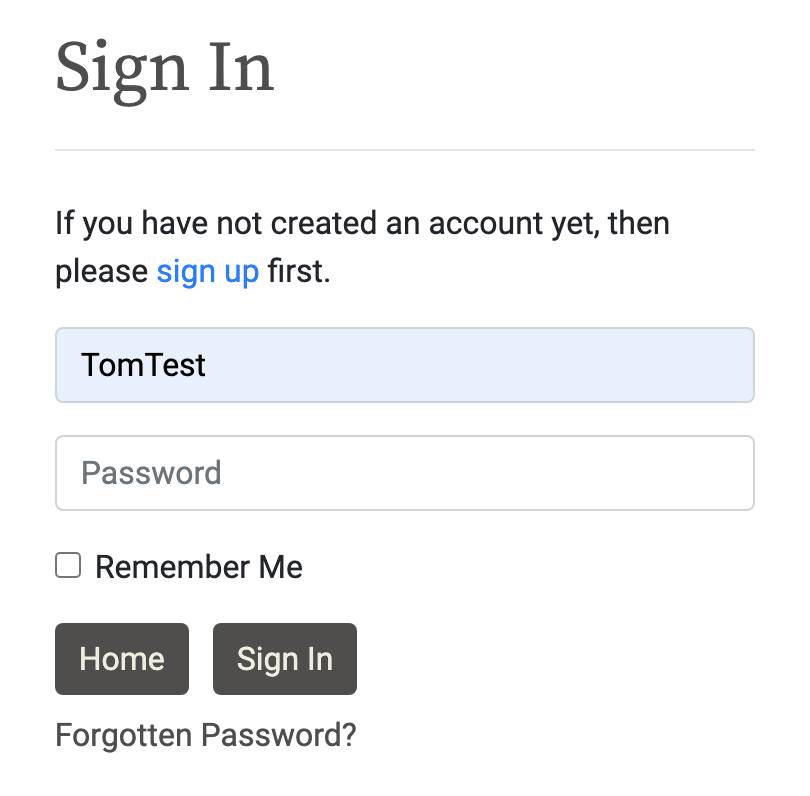
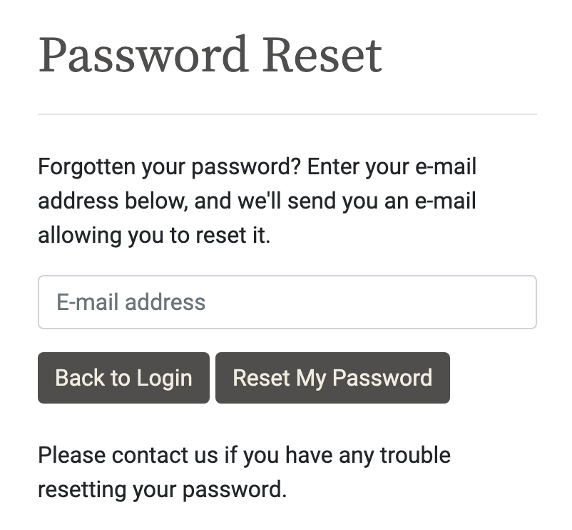
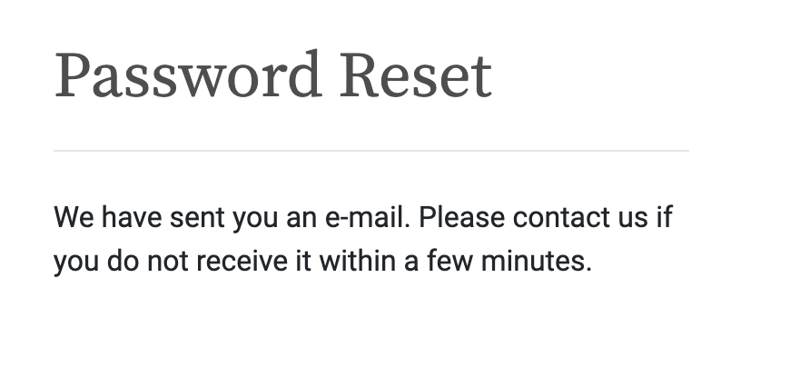
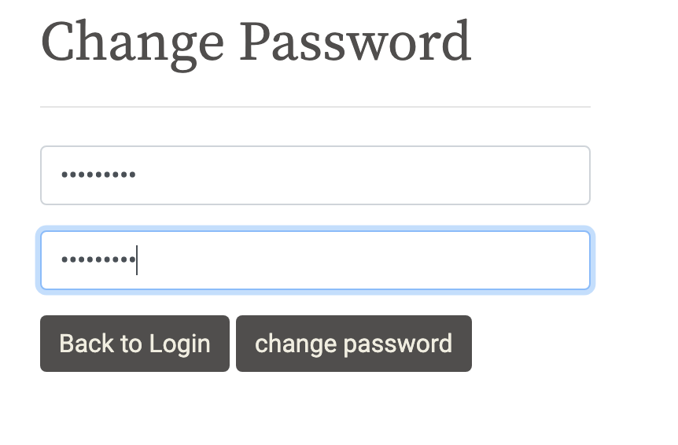
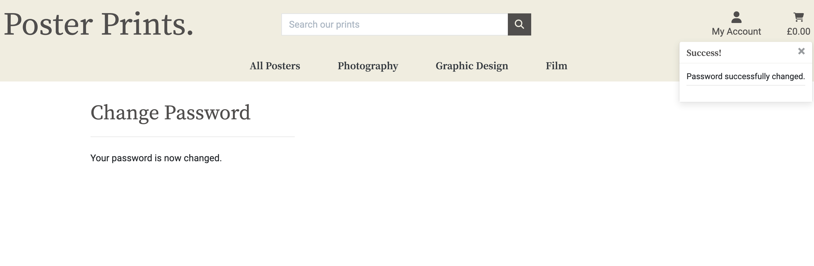
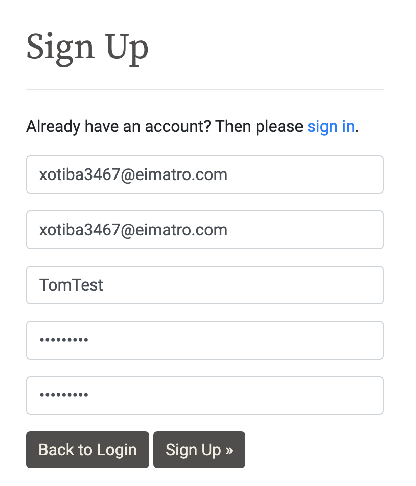
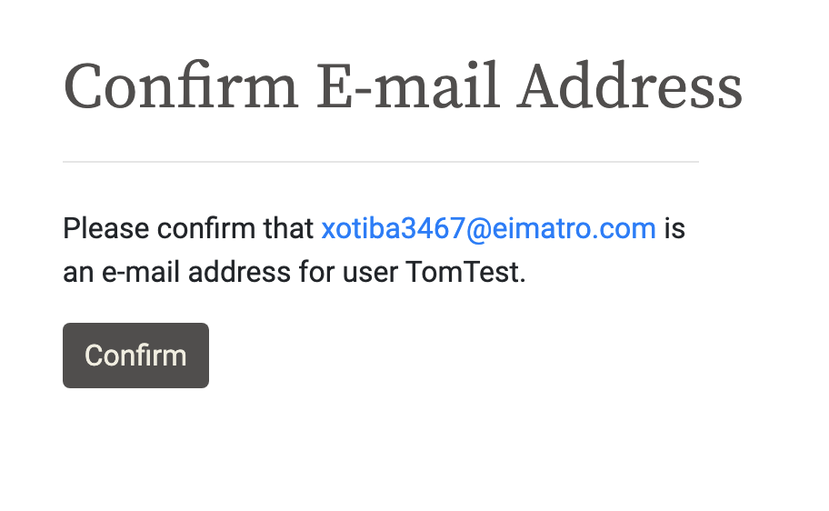
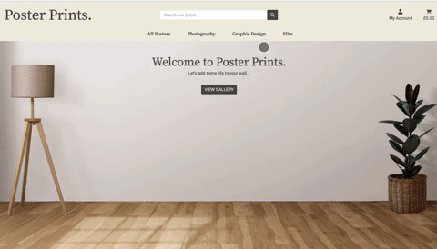
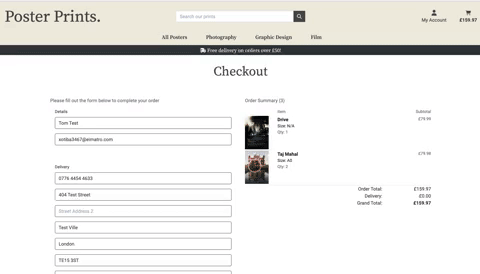
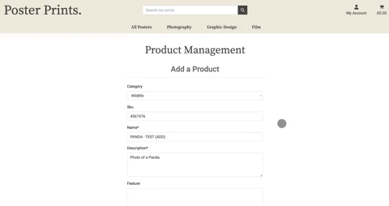

# __Poster Prints Testing__


[Live webpage](https://poster-prints-8ff329d79ba2.herokuapp.com/)

## __Contents__

1. [Automated Testing](#automated-testing)
1. [Validation Testing](#validation-testing)
    * [HTML Validation](#HTML-validation)
    * [CSS Validation](#CSS-validation)
    * [JavaScript Validation](#javascript-validation)
    * [Python Validation](#python-validation)
    * [Accessibility](#accessibility)
    * [Performance](#performance)
2. [Manual Testing](#manuel-testing)
    * [Device Testing](#device-testing)
    * [Browser Compatibility](#browser-compatibility)
    * [Testing User Stories](#testing-user-stories)
3. [Bugs](#bugs)

I consistently tested throughout the build of the project with Chrome developer tools, utilising print statements in python, writing unit tests for models, views and forms and checking for device compatibility at each stage of the development.

## Automated Testing
_ _ _

- I wrote a number of unit tests(32) using the Django unit test framework [Django TestCase](https://docs.djangoproject.com/en/4.1/topics/testing/overview/)

- I also used [coverage](https://pypi.org/project/coverage/) for feedback on the tests.

### Testing Results

A total of 32 test all passing with no errors.


### Coverage Results

<details><summary>Coverage Report</summary>

</details><br>

- As you can see from the report, while I have written plenty of tests which pass, a lot of them miss resulting in a low coverage percentage.
- This is an area I look forward to learning more about and utilising as I progress as a developer as it's an area I know I can improve. I know it will prove more and more useful helping me write more robust and tested code for future projects.

## Validation Testing

_ _ _

### HTML Validation

[W3C](https://validator.w3.org/) Markup Validation Service was used to validate the HTML of the website. All pages pass with no errors.

- Bag [results](https://validator.w3.org/nu/?showsource=yes&showoutline=yes&doc=https%3A%2F%2Fposter-prints-8ff329d79ba2.herokuapp.com%2Fbag%2F)
- Checkout [results](https://validator.w3.org/nu/?showsource=yes&showoutline=yes&doc=https%3A%2F%2Fposter-prints-8ff329d79ba2.herokuapp.com%2Fcheckout%2F)
- Checkout Success [results](https://validator.w3.org/nu/?showsource=yes&showoutline=yes&doc=https%3A%2F%2Fposter-prints-8ff329d79ba2.herokuapp.com%2Fcheckout%2Fcheckout_success%2F2C24A64E7ED64A0CA1BADFAC4D905053)
- Contact [results](https://validator.w3.org/nu/?showsource=yes&showoutline=yes&doc=https%3A%2F%2Fposter-prints-8ff329d79ba2.herokuapp.com%2Fcontact%2F)
- Contact Success [results](documentation/testing/contact-success.png)
- Favourites [results](https://validator.w3.org/nu/?showsource=yes&showoutline=yes&doc=https%3A%2F%2Fposter-prints-8ff329d79ba2.herokuapp.com%2Ffavourites%2F)
- Home [results](https://validator.w3.org/nu/?showsource=yes&showoutline=yes&doc=https%3A%2F%2Fposter-prints-8ff329d79ba2.herokuapp.com%2F)
- Products [results](https://validator.w3.org/nu/?showsource=yes&showoutline=yes&doc=https%3A%2F%2Fposter-prints-8ff329d79ba2.herokuapp.com%2Fproducts%2F%3Frandom%3DTrue)
- Product Detail [results](https://validator.w3.org/nu/?showsource=yes&showoutline=yes&doc=https%3A%2F%2Fposter-prints-8ff329d79ba2.herokuapp.com%2Fproducts%2F14%2F)
- Product - Add [results](https://validator.w3.org/nu/?doc=https%3A%2F%2Fposter-prints-8ff329d79ba2.herokuapp.com%2Faccounts%2Flogin%2F%3Fnext%3D%2Fproducts%2Fadd%2F)
- Product - Edit [results](https://validator.w3.org/nu/?doc=https%3A%2F%2Fposter-prints-8ff329d79ba2.herokuapp.com%2Faccounts%2Flogin%2F%3Fnext%3D%2Fproducts%2Fedit%2F35%2F)
- Profile [results](https://poster-prints-8ff329d79ba2.herokuapp.com/profile/)
- Errors [results](documentation/testing/errors.png)

### CSS Validation

[W3C](https://validator.w3.org/) Jigsaw CSS Validation Service was used to validate the CSS of the website.
All pass with no errors, occassional warning when webkits used.


<details><summary>base.css</summary>

</details><br>
<details><summary>bag.css</summary>

</details><br>
<details><summary>checkout.css</summary>

</details><br>
<details><summary>contact.css</summary>

</details><br>
<details><summary>favourites.css</summary>

</details><br>
<details><summary>products.css</summary>

</details><br>
<details><summary>profiles.css</summary>

</details><br>

### JavaScript Validation

[JS Hint](https://jshint.com/) JS Validation Service was used to validate the Javascript files. All pass with no issues.
All code from the Boutique Ado project was left out to ensure the testing was done on only my code.

<details><summary>base.js</summary>

</details><br>
<details><summary>bag.js</summary>

</details><br>
<details><summary>favourites.js</summary>

</details><br>
<details><summary>product_detail.js</summary>

</details><br>
<details><summary>products.js</summary>

</details><br>

### Python Validation

[pep8ci](#https://pep8ci.herokuapp.com/) was the linter used to check the python code, all clear with no errors.
<br>

| File | Result | Proof |
| :--- | :--- | :---: |
| custom_storages.py | Pass | [custom_storages.py validation](documentation/testing/linter/custom-storage.png) |
| **POSTER_PRINTS** |
| poster_prints/settings.py | Pass | [settings.py validation](documentation/testing/linter/settings.png) |
| poster_prints/urls.py | Pass | [urls.py validation](documentation/testinglinter/urls.png) |
| **BAG** |
| bag/apps.py | Pass | [apps.py validation](documentation/testing/linter/bag-apps.png) |
| bag/contexts.py | Pass | [contexts.py validation](documentation/testing/linter/bag-context.png) |
| bag/urls.py | Pass | [urls.py validation](documentation/testinglinter/bag-urls.png) |
| bag/views.py | Pass | [views.py validation](documentation/testing/linter/bag-views.png) |
| bag/templatetags/bag_tools.py | Pass | [bag_tools.py validation](documentation/testing/linter/bag-tools.png)|
| bag/test_views.py | Pass | [test_views.py validation](documentation/testing/linter/bag-test-views.png) |
| **CHECKOUT** |
| checkout/admin.py | Pass | [admin.py validation](documentation/testing/linter/checkout-admin.png) |
| checkout/apps.py | Pass | [apps.py validation](documentation/testing/linter/checkout-apps.png) |
| checkout/forms.py | Pass | [forms.py validation](documentation/testing/linter/checkout-forms.png) |
| checkout/models.py | Pass | [models.py validation](documentation/testing/linter/checkout-models.png) |
| checkout/signals.py | Pass | [signals.py validation](documentation/testing/linter/checkout-signals.png) |
| checkout/urls.py | Pass | [urls.py validation](documentation/testing/linter/checkout-urls.png) |
| checkout/views.py | Pass | [views.py validation](documentation/testing/linter/checkout-views.png) |
| checkout/webhook_handler.py | Pass | [webhook_handler.py](documentation/testing/linter/checkout-webhook-handler.png) |
| checkout/webhooks.py | Pass| [webhooks.py](documentation/testing/linter/checkout-webhooks.png) |
| checkout/test_forms.py | Pass | [test_forms.py validation](documentation/testing/linter/checkout-test-forms.png)|
| checkout/test_models.py | Pass | [test_models.py validation](documentation/testing/linter/checkout-test-models.png)|
| checkout/test_views.py | Pass | [test_views.py validation](documentation/testing/linter/checkout-test-views.png) |
| **CONTACT** |
| contact/admin.py | Pass |[admin.py validation](documentation/testing/linter/contact-admin.png) |
| contact/apps.py | Pass | [apps.py validation](documentation/testing/linter/contact-apps.png) |
| contact/forms.py | Pass | [forms.py validation](documentation/testing/linter/contact-forms.png) |
| contact/models.py | Pass | [models.py validation](documentation/testing/linter/contact-models.png) |
| contact/urls.py | Pass | [urls.py validation](documentation/testing/linter/contact-urls.png) |
| contact/views.py | Pass | [views.py validation](documentation/testing/linter/contact-views.png) |
| contact/test_forms.py | Pass | [test_forms.py validation](documentation/testing/linter/contact-test-forms.png) |
| contact/test_models.py | Pass | [test_models.py validation](documentation/testing/linter/contact-test-models.png) |
| contact/test_views.py | Pass | [test_views.py validation](documentation/testing/linter/contact-test-views.png) |
| **FAVOURITES** |
| favourites/apps.py | Pass | [apps.py validation](documentation/testing/linter/favourites-apps.png) |
| favourites/contexts.py | Pass | [contexts.py validation](documentation/testing/linter/favourites-contexts.png) |
| favourites/urls.py | Pass | [urls.py validation](documentation/testing/linter/favourites-urls.png) |
| favourites/models.py | Pass | [models.py validation](documentation/testing/linter/favourites-models.png) |
| favourites/views.py | Pass | [views.py validation](documentation/testing/linter/favourites-views.png) |
| favourites/test_models.py | Pass | [test_models.py validation](documentation/testing/linter/favourites-test-models.png)|
| favourites/test_views.py | Pass | [test_views.py validation](documentation/testing/linter/favourites-test-views.png) |
| **HOME** |
| home/apps.py | Pass | [apps.py validation](documentation/testing/linter/home-apps.png) |
| home/urls.py | Pass | [urls.py validation](documentation/testing/linter/home-urls.png)|
| home/views.py | Pass | [views.py validation](documentation/testing/linter/home-views.png) |
| home/test_views.py | Pass | [test_views.py validation](documentation/testing/linter/home-test-views.png) |
| **PRODUCTS** |
| products/admin.py | Pass | [admin.py validation](documentation/testing/linter/products-admin.png) |
| products/apps.py | Pass | [apps.py validation](documentation/testing/linter/products-apps.png) |
| products/forms.py | Pass | [forms.py validation](documentation/testing/linter/products-forms.png) |
| products/models.py | Pass | [models.py validation](documentation/testing/linter/products-models.png) |
| products/urls.py | Pass | [urls.py validation](documentation/testing/linter/products-urls.png) |
| products/views.py | Pass | [views.py validation](documentation/testing/linter/products-views.png) |
| products/widgets.py | Pass | [widgets.py validation](documentation/testing/linter/products-widgets.png) |
| products/test_models.py | Pass | [test_models.py validation](documentation/testing/linter/products-test-models.png) |
| products/test_views.py | Pass | [test_views.py validation](documentation/testing/linter/products-test-views.png) |
| **PROFILES** |
| profiles/apps.py | Pass | [apps.py validation](documentation/testing/linter/profiles-apps.png) |
| profiles/forms.py | Pass | [forms.py validation](documentation/testing/linter/profiles-forms.png) |
| profiles/models.py | Pass | [models.py validation](documentation/testing/linter/profiles-models.png) |
| profiles/urls.py | Pass | [urls.py validation](documentation/testing/linter/profiles-urls.png) |
| profiles/views.py | Pass | [views.py validation](documentation/testing/linter/profiles-views.png) |
| profiles/test_models.py | Pass | [test_models.py validation](documentation/testing/linter/profiles-test-models.png) |
| profiles/test_views.py | Pass | [test_views.py validation](documentation/testing/linter/profiles-test-views.png) |


### Performance

Performance testing was done using lighthouse in chrome developer tools testing the performance, accessibility, best practices, and SEO of the website. Some of the scores are lower than I'd like them to be, this is down mainly to resources blocking the first paint of the page. This is something with more time I'd like to read up on and gain a better undertsanding but due to time contraints I am happy with the current scores.
<br>
<details><summary>First Paint Message Example</summary>

</details><br>

**Lighthouse Desktop Test Results**

<details><summary>Bag</summary>

</details><br>
<details><summary>Checkout</summary>

</details><br>
<details><summary>Checkout Success</summary>

</details><br>
<details><summary>Contact</summary>

</details><br>
<details><summary>Contact Success</summary>

</details><br>
<details><summary>Favourites</summary>

</details><br>
<details><summary>Home</summary>

</details><br>
<details><summary>Products</summary>

</details><br>
<details><summary>Product Detail</summary>

</details><br>
<details><summary>Product Add</summary>

</details><br>
<details><summary>Product Edit</summary>

</details><br>
<details><summary>Profile</summary>

</details><br>
<details><summary>Register</summary>

</details><br>
<details><summary>Sign In</summary>

</details><br>
<details><summary>Sign Out</summary>

</details><br>

**Lighthouse Mobile Test Results**

<details><summary>Bag</summary>

</details><br>
<details><summary>Checkout</summary>

</details><br>
<details><summary>Checkout Success</summary>

</details><br>
<details><summary>Contact</summary>

</details><br>
<details><summary>Contact Success</summary>

</details><br>
<details><summary>Favourites</summary>

</details><br>
<details><summary>Home</summary>

</details><br>
<details><summary>Products</summary>

</details><br>
<details><summary>Product Detail</summary>

</details><br>
<details><summary>Product Add</summary>

</details><br>
<details><summary>Product Edit</summary>

</details><br>
<details><summary>Profile</summary>

</details><br>
<details><summary>Register</summary>

</details><br>
<details><summary>Sign In</summary>

</details><br>
<details><summary>Sign Out</summary>

</details><br>

### Accessibility

To ensure the site is accessible as possible I have taken the following steps;

- Using semantic HTML.
- Descriptive alt attributes on images.
- Label functions, links, buttons, forms and input fields to ensure clarity of the roles for all features.
- Ensuring that there is a sufficient colour contrast throughout the site.

[Wave accessibility](#https://wave.webaim.org/) was used to test the websites accessibility, all results have no warnings or errors.

- Due to restrictions when logged or having items in the bag I am only able to provided live links of areas that aren't restricted.

- Bag (empty) [results](https://wave.webaim.org/report#/https://poster-prints-8ff329d79ba2.herokuapp.com/bag/)
- Contact [results](https://wave.webaim.org/report#/https://poster-prints-8ff329d79ba2.herokuapp.com/contact/)
- Home [results](https://wave.webaim.org/report#/https://poster-prints-8ff329d79ba2.herokuapp.com/)
- Products [results](https://wave.webaim.org/report#/https://poster-prints-8ff329d79ba2.herokuapp.com/products/?random=True)
- Product Detail [results](https://wave.webaim.org/report#/https://poster-prints-8ff329d79ba2.herokuapp.com/products/47/)
- Errors [results](https://wave.webaim.org/report#/https://poster-prints-8ff329d79ba2.herokuapp.com/34566rgt)
- Register [results](https://wave.webaim.org/report#/https://poster-prints-8ff329d79ba2.herokuapp.com/accounts/signup/)
- Sign In [results](https://wave.webaim.org/report#/https://poster-prints-8ff329d79ba2.herokuapp.com/accounts/login/)


## Manuel Testing
_ _ _

### Device testing
The website was tested on the following devices:
- MacBook Pro
- iPad Tablet
- Google Pixel 5
- iPhone 12

In addition, the website was tested using Google Chrome Developer Tools device toggle option for all available device options.

### Browser Compatibility

The website was tested on the following browsers:
- Google Chrome
- Apple Safari
- Mozilla Firefox


### Developer Feature Testing

| Feature | Testing Performed | Pass/Fail |
| --- | --- | --- |
| Links | Check all links navigate correctly | Pass |


### Testing User Stories
_ _ _

**Viewing & Navigation**

1. As a shopper I want to be able to view a list of products so that I can select some to purchase.

    | **Feature** | **Action** | **Expected Result** | **Actual Result** |
    |-------------|------------|---------------------|-------------------|
    | View gallery  | Click button  | Go to all posters view | Works as expected |
    | All posters  | Click drop down link  | Go to all posters view | Works as expected |

    <details><summary>View Gallery</summary>
    
    </details>
    <br>
    <details><summary>All Posters</summary>
    
    </details>
    <br>

2. As a shopper I want to be able to view specific category of products so that I can quickly find posters I'm interested in without having to search through all options.

    | **Feature** | **Action** | **Expected Result** | **Actual Result** |
    |-------------|------------|---------------------|-------------------|
    | Main category nav link | Click link | Go to specified category page | Works as expected |
    | Sub category nav link | Click link | Go to specified category page | Works as expected |

    <details><summary>View Category</summary>
    
    </details>
    <br>

3. As a shopper I want to be able to view individual product details so that I can identify the price, description, product rating, product image and available sizes.

    | **Feature** | **Action** | **Expected Result** | **Actual Result** |
    |-------------|------------|---------------------|-------------------|
    | View product detail | Click on poster | View product detail page | Works as expected |

    <details><summary>Product Detail</summary>
    
    </details>
    <br>

4. As a shopper I want to be able to identify stock levels on items low on stock so that I can insure I don't miss out on items I want.

    | **Feature** | **Action** | **Expected Result** | **Actual Result** |
    |-------------|------------|---------------------|-------------------|
    | View product detail | Click on poster | Stock levels displayed if low | Works as expected |

    <details><summary>View Stock Levels</summary>
    
    </details>
    <br>

5. As a shopper I want to be able to easily view the total of my purchases at any time so that I can avoid spending too much.

    | **Feature** | **Action** | **Expected Result** | **Actual Result** |
    |-------------|------------|---------------------|-------------------|
    | Cart View | Add item to cart | See cart total increase in header | Works as expected |

    <details><summary>Cart View</summary>
    
    </details>
    <br>

6. As a shopper I want to be able to easily contact the store whether I have an account or not so that I can have any query answered.

    | **Feature** | **Action** | **Expected Result** | **Actual Result** |
    |-------------|------------|---------------------|-------------------|
    | Find contact form | Click link in footer  | To go contact page | Works as expected |
    | Send Message | Fill out form  | To go contact success page | Works as expected |
    | Proof of message received | Check emails | Contact message confirmation email received | Works as expected |

    <details><summary>View Contact Page</summary>
    
    </details>
    <br>
    <details><summary>Contact Success Page</summary>
    
    </details>
    <br>
    <details><summary>Email Received</summary>
    
    </details>
    <br>

**Registration & User Accounts**

7. As a site user I want to be able to easily register for an account so that I can have a personal account and be able to view my profile.

    | **Feature** | **Action** | **Expected Result** | **Actual Result** |
    |-------------|------------|---------------------|-------------------|
    | Register account | Click register drop down link | To go register page | Works as expected |

    <details><summary>Register Page</summary>
    
    </details>
    <br>

8. As a site user I want to be able to easily login or logout so that I can access my personal account information.

    | **Feature** | **Action** | **Expected Result** | **Actual Result** |
    |-------------|------------|---------------------|-------------------|
    | Login | Click link & enter details | User logged in | Works as expected |
    | Logout | Click link & confirm sign out with button | User logged out | Works as expected |

    <details><summary>Login</summary>
    
    </details>
    <br>
    <details><summary>Logout</summary>
    
    </details>
    <br>

9. As a site user I want to be able to Easily recover my password incase I forget it so that I can easily recover access to my account.

    | **Feature** | **Action** | **Expected Result** | **Actual Result** |
    |-------------|------------|---------------------|-------------------|
    | Forgotten password | Click 'Forgotten Password?' link | Go to reset password confirmation page | Works as expected |
    | Confirm email | Confirm email on the account | Go to reset link email confirmation page | Works as expected |
    | Reset link | Click link | Go to reset password page | Works as expected |
    | New password | Enter new password | Confirm new password | Works as expected |
    | New password confirmed | Click 'change password' button | New password confirmed | Works as expected |

    <details><summary>Forgotten Password</summary>
    
    </details>
    <br>
    <details><summary>Confirm Email</summary>
    
    </details>
    <br>
    <details><summary>Confirmation email Page</summary>
    
    </details>
    <br>
    <details><summary>Reset Link</summary>
    
    </details>
    <br>
    <details><summary>Enter New Password</summary>
    
    </details>
    <br>
    <details><summary>New Password Confirmation</summary>
    
    </details>
    <br>


10. Site user I want to be able to receive confimation after registering so that I can easily verify that my account registration was successful.

    | **Feature** | **Action** | **Expected Result** | **Actual Result** |
    |-------------|------------|---------------------|-------------------|
    | Fill out form | Click sign up button | Receive email confirmation link | Works as expected |
    | Confirmation link | Click link | To go confirm email page | Works as expected |
    | Confirm email button | Click button | Go to email confirmed page | Works as expected |

    <details><summary>Fill Out form</summary>
    
    </details>
    <br>
    <details><summary>Confirmation Link</summary>
    
    </details>
    <br>
    <details><summary>Confirm Email</summary>
    
    </details>
    <br>
    <details><summary>Email Confirmed</summary>
    
    </details>
    <br>

11. Site user I want to be able to Have a personalised user profile so that I can easily view my personal order history and order confirmations, and save my payment information.

    | **Feature** | **Action** | **Expected Result** | **Actual Result** |
    |-------------|------------|---------------------|-------------------|
    | Profile | Login | To go to profile page | Works as expected |

    <details><summary>View Profile</summary>
    
    </details>
    <br>

**Sorting & Searching**

12. As a shopper I want to be able to store and view my favourite posters so that I can easily find them when I am ready to purchase.

    | **Feature** | **Action** | **Expected Result** | **Actual Result** |
    |-------------|------------|---------------------|-------------------|
    | Add to favourites | Click on favourites icon | Poster is added to favourites | Works as expected |
    | Favourites Page | Click favourites drop down link | To go favourites page | Works as expected |

    <details><summary>Add to Favourites</summary>
    
    </details>
    <br>
    <details><summary>View List</summary>
    
    </details>
    <br>

13. As a shopper I want to be able to sort the list of available posters so that I can easily identify the best priced and categorically sorted products.

    | **Feature** | **Action** | **Expected Result** | **Actual Result** |
    |-------------|------------|---------------------|-------------------|
    | Sort by price | Select price by ascending or descending | View by price | Works as expected |
    | Sort by category | Select by category | View by category | Works as expected |

    <details><summary>Sort By Price</summary>
    
    </details>
    <br>
    <details><summary>Sort By Category</summary>
    
    </details>
    <br>

14. As a shopper I want to be able to sort a specific category of poster so that I can find the best-priced or in a specific category, or sort the products in that category by name.

    | **Feature** | **Action** | **Expected Result** | **Actual Result** |
    |-------------|------------|---------------------|-------------------|
    | Search specific category | Select by name or price | View alphabetically or by price | Works as expected |

    <details><summary>Specific Category Search</summary>
    
    </details>
    <br>

15. As a shopper I want to be able to sort multiple categories of products simultaneously so that I can find the best-priced across the broad categories, such as 'photography' or 'Film'.

    | **Feature** | **Action** | **Expected Result** | **Actual Result** |
    |-------------|------------|---------------------|-------------------|
    | Search broad category | Select by name or price | View alphabetically or by price | Works as expected |

    <details><summary>Broad Category Search</summary>
    
    </details>
    <br>

16. As a shopper I want to be able to search for a poster by name or description so that I can find a specific product I'd like to purchase.

    | **Feature** | **Action** | **Expected Result** | **Actual Result** |
    |-------------|------------|---------------------|-------------------|
    | Search by name | Enter name | Name search results displayed | Works as expected |
    | Search by description | Enter description | Description search results displayed | Works as expected |

    <details><summary>Search Name</summary>
    
    </details>
    <br>
    <details><summary>Search Description</summary>
    
    </details>
    <br>

17. As a shopper I want to be able to easily see what I've searched for and the number of results so that I can quickly decide whether the product I want is available.

    | **Feature** | **Action** | **Expected Result** | **Actual Result** |
    |-------------|------------|---------------------|-------------------|
    | View search results | Search for multiple posters | Search results and number displayed | Works as expected |

    <details><summary>View Search Results</summary>
    
    </details>
    <br>

**Purchasing & Checkout**


18. As a shopper I want to be able to easily select the size and quantity of a poster when purchasing it so that I can ensure I don't accidentally select the wrong poster, quantity or size.

    | **Feature** | **Action** | **Expected Result** | **Actual Result** |
    |-------------|------------|---------------------|-------------------|
    | Select Size / Quantity | Select size and / or quantity on product detail page | Size and Quanity changes on selection | Works as expected |

    <details><summary>Select Size / Quantity</summary>
    
    </details>
    <br>

19. As a shopper I want to be able to view items in my bag to purchase so that I can identify the total cost of my purchase and all items I will receive.

    | **Feature** | **Action** | **Expected Result** | **Actual Result** |
    |-------------|------------|---------------------|-------------------|
    | View cart | Click on cart icon | View cart with selected items in it | Works as expected |

    <details><summary>View Cart</summary>
    
    </details>
    <br>

20. As a shopper I want to be able to adjust the quantity of individual items in my bag so that I can easily make changes to my purchases before checkout.

    | **Feature** | **Action** | **Expected Result** | **Actual Result** |
    |-------------|------------|---------------------|-------------------|
    | Adjust Quantity in Cart | Change quantity with selector, click update | Quantity is updated | Works as expected |

    <details><summary>Adjust Quantity</summary>
    
    </details>
    <br>

21. As a shopper I want to be able to easily enter my payment information so that I can check out quickly and with no hassles.

    | **Feature** | **Action** | **Expected Result** | **Actual Result** |
    |-------------|------------|---------------------|-------------------|
    | Information Form | Fil out form | Clearly labelled form to fill out | Works as expected |

    <details><summary>View Checkout From</summary>
    
    </details>
    <br>

22. As a shopper I want to be able to feel my personal payment information is safe and secure so that I can confidently provide the needed information to make a purchase.

    | **Feature** | **Action** | **Expected Result** | **Actual Result** |
    |-------------|------------|---------------------|-------------------|
    | Secure Checkout | Click secure checkout button | View payment is via stripe (footer) | Works as expected |
    | Secure Checkout | Click secure checkout button | Information only populated if logged in and saved to profile | Works as expected |

    <details><summary>Secure Checkout</summary>
    
    </details>
    <br>

23. As a shopper I want to be able to view an order confirmation after checkout so that I can verify that I haven't made any mistakes.

    | **Feature** | **Action** | **Expected Result** | **Actual Result** |
    |-------------|------------|---------------------|-------------------|
    | Make Payment | Click 'buy now' button | Checkout Success page confirms order | Works as expected |

    <details><summary>Make Payment</summary>
    
    </details>
    <br>

24. As a shopper I want to be able to receive an email confimation after checking out so that I can keep the confirmation of what I've purchased for my records.

    | **Feature** | **Action** | **Expected Result** | **Actual Result** |
    |-------------|------------|---------------------|-------------------|
    | Make Payment | Click 'buy now' button | Checkout Success page confirms order | Works as expected |
    | Confirmation Email | Click 'buy now' button | Order confirmation email confirms order | Works as expected |

    <details><summary>Make Payment</summary>
    
    </details>
    <br>
    <details><summary>Order Confirmation Email</summary>
    
    </details>
    <br>

**Admin & Store Management**

25. As a store owner I want to be able to add a poster so that I can upload new posters for sale to my store.

    | **Feature** | **Action** | **Expected Result** | **Actual Result** |
    |-------------|------------|---------------------|-------------------|
    | Add Product Page | Click Manage Items | Go to add product page | Works as expected |
    | Add Product | Fill out form, add product | New product is added | Works as expected |

    <details><summary>Add Product Page</summary>
    
    </details>
    <br>
    <details><summary>Add Product</summary>
    
    </details>
    <br>

26. As a store owner I want to be able to Edit/Update a poster so that I can change product prices, descriptions, sizes, images, stock and other product criteria.

    | **Feature** | **Action** | **Expected Result** | **Actual Result** |
    |-------------|------------|---------------------|-------------------|
    | Edit Product Page | Click edit button | Go to edit product page | Works as expected |
    | Edit Product | Fill out form, edit product | Edited product is update | Works as expected |

    <details><summary>Edit Product Page</summary>
    
    </details>
    <br>
    <details><summary>Edit Product</summary>
    
    </details>
    <br>

27. As a store owner I want to be able to Delete a poster so that I can remove posters that are no longer for sale.

    | **Feature** | **Action** | **Expected Result** | **Actual Result** |
    |-------------|------------|---------------------|-------------------|
    | Delete Product | Click delete button, confirm deletion on delete modal | Product deleted | Works as expected |

    <details><summary>Delete Product</summary>
    
    </details>
    <br>

28. As a Store owner I want to be able to track and display stock so that I can ensure customers don't try and buy more than the stock number and so I can track stock that is low.

    | **Feature** | **Action** | **Expected Result** | **Actual Result** |
    |-------------|------------|---------------------|-------------------|
    | Stocked display - Product detail | Stock lower than 4 | Alert to say stock levels are low | Works as expected |
    | Stocked display - Product detail | Stock at 0 | Alert to poster is out of stock | Works as expected |
    | Stocked item - Product detail | Add more than stock | Message display explains quantity is above stock level | Works as expected |
    | Stocked item - Cart | Add more than stock | Message display explains quantity is above stock level | Works as expected |

    <details><summary>Stock Level < 4</summary>
    
    </details>
    <br>
    <details><summary>Stock Level = 0</summary>
    
    </details>
    <br>
    <details><summary>Stocked Item - Product Detail</summary>
    
    </details>
    <br>
    <details><summary>Stocked Item - Cart</summary>
    
    </details>
    <br>

29. As a store owner I want to be able to Ensure any errors direct the user back to the home page so that I can ensure I do not lose them as a customer.

    | **Feature** | **Action** | **Expected Result** | **Actual Result** |
    |-------------|------------|---------------------|-------------------|
    | Error page | Enter incorrect page source | 404 Error displayed with 'Home' button | Works as expected |

    <details><summary>Error Page</summary>
    
    </details>
    <br>

## Bugs

_ _ _

### Image2 Field Error

- As some products have 2 images I added an image2 field to the products model. For some reason the below error occurred if only an image was uploaded in the second field and not the first. 

    

- I tried to adjust the code to ignore the field if it was empty but couldn't find a way to make it work.
- To ensure no image is uploaded to the second image field before the first I used javascript to hide the image2 fields unless the first image field has a value.

    ```Javascript
        document.addEventListener('DOMContentLoaded', function() {
        const newImageInput = document.getElementById('new-image');
        const newImage2Input = document.getElementById('new-image2');
        const imageButton = document.getElementById('image2-button');
        const imageUrl = document.getElementById('div_id_image2_url');
        
            if (!newImageInput) {
                return;
            }
        
            newImageInput.addEventListener('change', function() {
                if (newImageInput.value) {
                    newImage2Input.disabled = false;
                    imageButton.hidden = false;
                    imageUrl.hidden = false;
                } else {
                    newImage2Input.disabled = true;
                    imageButton.hidden = true;
                    imageUrl.hidden = true;
                }
            });

            if (!newImageInput.value) {
            newImage2Input.disabled = true;
            imageButton.hidden = true;
            imageUrl.hidden = true;
            }
        });
    ```

### Tooltip

- I could not get the bootstrap tooltip to work, followed everything for the correct Bootstrap version, but for some reason it would not work. I took it onmyself to create one myself as I really wanted this feature for the star / favourite icon.
- This is the code I originally used.

    ```Javascript
        var star = document.querySelector('.fa-star');
        var tool = document.querySelector('.tool');

        star.addEventListener('mouseover', function() {
            tool.style.visibility = 'visible';
        });

        star.addEventListener('mouseout', function() {
            tool.style.visibility = 'hidden';
        });    
    ```
- The issue was that each time the icon was clicked and therefore changed as a favourite was added or remove the event listeners were still looking for the old icon. It was only after refreshing the page would the tooltip now show on mouse over.
- While this worked ok I knew it could work the way I wanted and should.
- Below is the new working code.

    ```Javascript
        const addStar = document.querySelector('.add');
        const removeStar = document.querySelector('.remove');
        const toolOne = document.querySelector('.tool1');
        const toolTwo = document.querySelector('.tool2');

        function toggleVisibility(element, isVisible) {
            element.style.visibility = isVisible ? 'visible' : 'hidden';
        }

        function handleMouseOver(event) {
            const target = event.target;
            if (target === addStar) {
            toggleVisibility(toolOne, true);
            } else if (target === removeStar) {
            toggleVisibility(toolTwo, true);
            }
        }

        function handleMouseOut(event) {
            const target = event.target;
            if (target === addStar) {
            toggleVisibility(toolOne, false);
            } else if (target === removeStar) {
            toggleVisibility(toolTwo, false);
            }
        }

        document.addEventListener('mouseover', handleMouseOver);
        document.addEventListener('mouseout', handleMouseOut);
    ```

- By creating individual classes for both icons and specific functions for each class the page no longer needs to refresh for the mouse over to display the tooltip or vice versa.
- Its a much more long winded way of doing it for such a small feature, but it wass important to me that it worked how I wanted it to. I am very pleased that it now works how it should.

### Stock Level - 0

- Product detial page displays stock as an alert when stock is 3 or below if it is at zero there is no display.
- This is the code used;

    ```Python
        
            
                <div class="col-12 stock-level text-danger">
                    <p><strong>Low stock! Only {{ product.stock }} left!</strong></p>
                </div>
            
        
    ```
- This code was then tried which did not work, still no display if 0;

    ```Python
        
            
                <div class="col-12 stock-level text-danger">
                    <p><strong>OUT OF STOCK!</strong></p>
                </div>
            
                <div class="col-12 stock-level text-danger">
                    <p><strong>Low stock! Only {{ product.stock }} left!</strong></p>
                </div>
            
        
    ```

- In the end writing two separate if statements worked.

    ```Python
        
            
                <div class="col-12 stock-level text-danger">
                    <p><strong>Low stock! Only {{ product.stock }} left!</strong></p>
                </div>
            
        
        
                <div class="col-12 stock-level text-danger">
                    <p><strong>OUT OF STOCK!</strong></p>
                </div>
        
    ```
