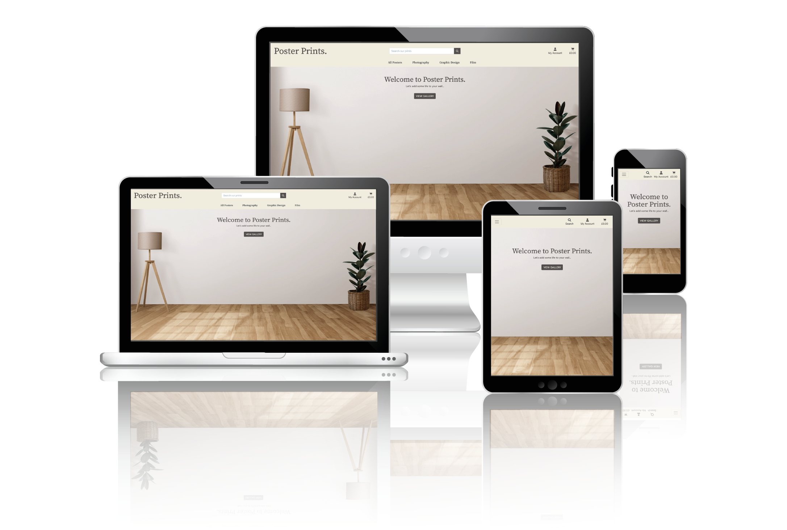

# __Poster Prints Testing__



[Live webpage](https://poster-prints-8ff329d79ba2.herokuapp.com/)

## __Contents__

1. [Automated Testing](#automated-testing)
1. [Validation Testing](#validation-testing)
    * [HTML Validation](#HTML-validation)
    * [CSS Validation](#CSS-validation)
    * [JavaScript Validation](#javascript-validation)
    * [Python Validation](#python-validation)
    * [Accessibility](#accessibility)
    * [Performance](#performance)
2. [Manual Testing](#manuel-testing)
    * [Device Testing](#device-testing)
    * [Browser Compatibility](#browser-compatibility)
    * [Testing User Stories](#testing-user-stories)
3. [Bugs](#bugs)

I consistently tested throughout the build of the project with Chrome developer tools, utilising print statements in python, writing unit tests for models, views and forms and checking for device compatibility at each stage of the development.

## Automated Testing
_ _ _

- I wrote a number of unit tests(32) using the Django unit test framework [Django TestCase](https://docs.djangoproject.com/en/4.1/topics/testing/overview/)

- I also used [coverage](https://pypi.org/project/coverage/) for feedback on the tests.

### Testing Results

A total of 32 test all passing with no errors.


### Coverage Results

<details><summary>Coverage Report</summary>

</details><br>

- As you can see from the report, while I have written plenty of tests which pass, a lot of them miss resulting in a low coverage percentage.
- This is an area I look forward to learning more about and utilising as I progress as a developer as it's an area I know I can improve. I know it will prove more and more useful helping me write more robust and tested code for future projects.

## Validation Testing

_ _ _

### HTML Validation

[W3C](https://validator.w3.org/) Markup Validation Service was used to validate the HTML of the website. All pages pass with no errors.

- Bag [results](https://validator.w3.org/nu/?showsource=yes&showoutline=yes&doc=https%3A%2F%2Fposter-prints-8ff329d79ba2.herokuapp.com%2Fbag%2F)
- Checkout [results](https://validator.w3.org/nu/?showsource=yes&showoutline=yes&doc=https%3A%2F%2Fposter-prints-8ff329d79ba2.herokuapp.com%2Fcheckout%2F)
- Checkout Success [results](https://validator.w3.org/nu/?showsource=yes&showoutline=yes&doc=https%3A%2F%2Fposter-prints-8ff329d79ba2.herokuapp.com%2Fcheckout%2Fcheckout_success%2F2C24A64E7ED64A0CA1BADFAC4D905053)
- Contact [results](https://validator.w3.org/nu/?showsource=yes&showoutline=yes&doc=https%3A%2F%2Fposter-prints-8ff329d79ba2.herokuapp.com%2Fcontact%2F)
- Contact Success [results](documentation/testing/contact-success.png)
- Favourites [results](https://validator.w3.org/nu/?showsource=yes&showoutline=yes&doc=https%3A%2F%2Fposter-prints-8ff329d79ba2.herokuapp.com%2Ffavourites%2F)
- Home [results](https://validator.w3.org/nu/?showsource=yes&showoutline=yes&doc=https%3A%2F%2Fposter-prints-8ff329d79ba2.herokuapp.com%2F)
- Products [results](https://validator.w3.org/nu/?showsource=yes&showoutline=yes&doc=https%3A%2F%2Fposter-prints-8ff329d79ba2.herokuapp.com%2Fproducts%2F%3Frandom%3DTrue)
- Product Detail [results](https://validator.w3.org/nu/?showsource=yes&showoutline=yes&doc=https%3A%2F%2Fposter-prints-8ff329d79ba2.herokuapp.com%2Fproducts%2F14%2F)
- Product - Add [results](https://validator.w3.org/nu/?doc=https%3A%2F%2Fposter-prints-8ff329d79ba2.herokuapp.com%2Faccounts%2Flogin%2F%3Fnext%3D%2Fproducts%2Fadd%2F)
- Product - Edit [results](https://validator.w3.org/nu/?doc=https%3A%2F%2Fposter-prints-8ff329d79ba2.herokuapp.com%2Faccounts%2Flogin%2F%3Fnext%3D%2Fproducts%2Fedit%2F35%2F)
- Profile [results](https://poster-prints-8ff329d79ba2.herokuapp.com/profile/)
- Errors [results](documentation/testing/errors.png)

### CSS Validation

[W3C](https://validator.w3.org/) Jigsaw CSS Validation Service was used to validate the CSS of the website.
All pass with no errors, occassional warning when webkits used.


<details><summary>base.css</summary>

</details><br>
<details><summary>bag.css</summary>

</details><br>
<details><summary>checkout.css</summary>

</details><br>
<details><summary>contact.css</summary>

</details><br>
<details><summary>favourites.css</summary>

</details><br>
<details><summary>products.css</summary>

</details><br>
<details><summary>profiles.css</summary>

</details><br>

### JavaScript Validation

[JS Hint](https://jshint.com/) JS Validation Service was used to validate the Javascript files. All pass with no issues.
All code from the Boutique Ado project was left out to ensure the testing was done on only my code.

<details><summary>base.js</summary>

</details><br>
<details><summary>bag.js</summary>

</details><br>
<details><summary>favourites.js</summary>

</details><br>
<details><summary>product_detail.js</summary>

</details><br>
<details><summary>products.js</summary>

</details><br>

### Python Validation

[pep8ci](#https://pep8ci.herokuapp.com/) was the linter used to check the python code, all clear with no errors.
<br>

| File | Result | Proof |
| :--- | :--- | :---: |
| custom_storages.py | Pass | [custom_storages.py validation](documentation/testing/linter/custom-storage.png) |
| **POSTER_PRINTS** |
| poster_prints/settings.py | Pass | [settings.py validation](documentation/testing/linter/settings.png) |
| poster_prints/urls.py | Pass | [urls.py validation](documentation/testinglinter/urls.png) |
| **BAG** |
| bag/apps.py | Pass | [apps.py validation](documentation/testing/linter/bag-apps.png) |
| bag/contexts.py | Pass | [contexts.py validation](documentation/testing/linter/bag-context.png) |
| bag/urls.py | Pass | [urls.py validation](documentation/testinglinter/bag-urls.png) |
| bag/views.py | Pass | [views.py validation](documentation/testing/linter/bag-views.png) |
| bag/templatetags/bag_tools.py | Pass | [bag_tools.py validation](documentation/testing/linter/bag-tools.png)|
| bag/test_views.py | Pass | [test_views.py validation](documentation/testing/linter/bag-test-views.png) |
| **CHECKOUT** |
| checkout/admin.py | Pass | [admin.py validation](documentation/testing/linter/checkout-admin.png) |
| checkout/apps.py | Pass | [apps.py validation](documentation/testing/linter/checkout-apps.png) |
| checkout/forms.py | Pass | [forms.py validation](documentation/testing/linter/checkout-forms.png) |
| checkout/models.py | Pass | [models.py validation](documentation/testing/linter/checkout-models.png) |
| checkout/signals.py | Pass | [signals.py validation](documentation/testing/linter/checkout-signals.png) |
| checkout/urls.py | Pass | [urls.py validation](documentation/testing/linter/checkout-urls.png) |
| checkout/views.py | Pass | [views.py validation](documentation/testing/linter/checkout-views.png) |
| checkout/webhook_handler.py | Pass | [webhook_handler.py](documentation/testing/linter/checkout-webhook-handler.png) |
| checkout/webhooks.py | Pass| [webhooks.py](documentation/testing/linter/checkout-webhooks.png) |
| checkout/test_forms.py | Pass | [test_forms.py validation](documentation/testing/linter/checkout-test-forms.png)|
| checkout/test_models.py | Pass | [test_models.py validation](documentation/testing/linter/checkout-test-models.png)|
| checkout/test_views.py | Pass | [test_views.py validation](documentation/testing/linter/checkout-test-views.png) |
| **CONTACT** |
| contact/admin.py | Pass |[admin.py validation](documentation/testing/linter/contact-admin.png) |
| contact/apps.py | Pass | [apps.py validation](documentation/testing/linter/contact-apps.png) |
| contact/forms.py | Pass | [forms.py validation](documentation/testing/linter/contact-forms.png) |
| contact/models.py | Pass | [models.py validation](documentation/testing/linter/contact-models.png) |
| contact/urls.py | Pass | [urls.py validation](documentation/testing/linter/contact-urls.png) |
| contact/views.py | Pass | [views.py validation](documentation/testing/linter/contact-views.png) |
| contact/test_forms.py | Pass | [test_forms.py validation](documentation/testing/linter/contact-test-forms.png) |
| contact/test_models.py | Pass | [test_models.py validation](documentation/testing/linter/contact-test-models.png) |
| contact/test_views.py | Pass | [test_views.py validation](documentation/testing/linter/contact-test-views.png) |
| **FAVOURITES** |
| favourites/apps.py | Pass | [apps.py validation](documentation/testing/linter/favourites-apps.png) |
| favourites/contexts.py | Pass | [contexts.py validation](documentation/testing/linter/favourites-contexts.png) |
| favourites/urls.py | Pass | [urls.py validation](documentation/testing/linter/favourites-urls.png) |
| favourites/models.py | Pass | [models.py validation](documentation/testing/linter/favourites-models.png) |
| favourites/views.py | Pass | [views.py validation](documentation/testing/linter/favourites-views.png) |
| favourites/test_models.py | Pass | [test_models.py validation](documentation/testing/linter/favourites-test-models.png)|
| favourites/test_views.py | Pass | [test_views.py validation](documentation/testing/linter/favourites-test-views.png) |
| **HOME** |
| home/apps.py | Pass | [apps.py validation](documentation/testing/linter/home-apps.png) |
| home/urls.py | Pass | [urls.py validation](documentation/testing/linter/home-urls.png)|
| home/views.py | Pass | [views.py validation](documentation/testing/linter/home-views.png) |
| home/test_views.py | Pass | [test_views.py validation](documentation/testing/linter/home-test-views.png) |
| **PRODUCTS** |
| products/admin.py | Pass | [admin.py validation](documentation/testing/linter/products-admin.png) |
| products/apps.py | Pass | [apps.py validation](documentation/testing/linter/products-apps.png) |
| products/forms.py | Pass | [forms.py validation](documentation/testing/linter/products-forms.png) |
| products/models.py | Pass | [models.py validation](documentation/testing/linter/products-models.png) |
| products/urls.py | Pass | [urls.py validation](documentation/testing/linter/products-urls.png) |
| products/views.py | Pass | [views.py validation](documentation/testing/linter/products-views.png) |
| products/widgets.py | Pass | [widgets.py validation](documentation/testing/linter/products-widgets.png) |
| products/test_models.py | Pass | [test_models.py validation](documentation/testing/linter/products-test-models.png) |
| products/test_views.py | Pass | [test_views.py validation](documentation/testing/linter/products-test-views.png) |
| **PROFILES** |
| profiles/apps.py | Pass | [apps.py validation](documentation/testing/linter/profiles-apps.png) |
| profiles/forms.py | Pass | [forms.py validation](documentation/testing/linter/profiles-forms.png) |
| profiles/models.py | Pass | [models.py validation](documentation/testing/linter/profiles-models.png) |
| profiles/urls.py | Pass | [urls.py validation](documentation/testing/linter/profiles-urls.png) |
| profiles/views.py | Pass | [views.py validation](documentation/testing/linter/profiles-views.png) |
| profiles/test_models.py | Pass | [test_models.py validation](documentation/testing/linter/profiles-test-models.png) |
| profiles/test_views.py | Pass | [test_views.py validation](documentation/testing/linter/profiles-test-views.png) |


### Performance

Performance testing was done using lighthouse in chrome developer tools testing the performance, accessibility, best practices, and SEO of the website. Some of the scores are lower than I'd like them to be, this is down mainly to resources blocking the first paint of the page. This is something with more time I'd like to read up on and gain a better undertsanding but due to time contraints I am happy with the current scores.
<br>
<details><summary>First Paint Message Example</summary>

</details><br>

**Lighthouse Test Results**

<details><summary>Bag</summary>

</details><br>
<details><summary>Checkout</summary>

</details><br>
<details><summary>Checkout Success</summary>

</details><br>
<details><summary>Contact</summary>

</details><br>
<details><summary>Contact Success</summary>

</details><br>
<details><summary>Favourites</summary>

</details><br>
<details><summary>Home</summary>

</details><br>
<details><summary>Products</summary>

</details><br>
<details><summary>Product Detail</summary>

</details><br>
<details><summary>Product Add</summary>

</details><br>
<details><summary>Product Edit</summary>

</details><br>
<details><summary>Profile</summary>

</details><br>
<details><summary>Register</summary>

</details><br>
<details><summary>Sign In</summary>

</details><br>
<details><summary>Sign Out</summary>

</details><br>

### Accessibility

To ensure the site is accessible as possible I have taken the following steps;

- Using semantic HTML.
- Descriptive alt attributes on images.
- Label functions and links to ensure clarity of the roles of each button, icon or clickable feature.
- Ensuring that there is a sufficient colour contrast throughout the site.

[Wave accessibility](#https://wave.webaim.org/) was used to test the websites accessibility

- Bag [results](https://wave.webaim.org/report#/https://poster-prints-8ff329d79ba2.herokuapp.com/bag/)
- Checkout [results]()
- Checkout Success [results]()
- Contact [results]()
- Contact Success [results]()
- Favourites [results]()
- Home [results](https://wave.webaim.org/report#/https://poster-prints-8ff329d79ba2.herokuapp.com/)
- Products [results](https://wave.webaim.org/report#/https://poster-prints-8ff329d79ba2.herokuapp.com/products/?random=True)
- Product Detail [results](https://wave.webaim.org/report#/https://poster-prints-8ff329d79ba2.herokuapp.com/products/47/)
- Product - Add [results]()
- Product - Edit [results]()
- Profile [results]()
- Errors [results]()
- Register [results](https://wave.webaim.org/report#/https://poster-prints-8ff329d79ba2.herokuapp.com/accounts/signup/)
- Sign In [results](https://wave.webaim.org/report#/https://poster-prints-8ff329d79ba2.herokuapp.com/accounts/login/)
_ _ _

## Manuel Testing

### Device testing
The website was tested on the following devices:
- MacBook Pro
- iPad Tablet
- Google Pixel 5
- iPhone 12

In addition, the website was tested using Google Chrome Developer Tools device toggle option for all available device options.

### Browser Compatibility

The website was tested on the following browsers:
- Google Chrome
- Apple Safari
- Mozilla Firefox

_ _ _

### Developer Feature Testing

| Feature | Testing Performed | Pass/Fail |
| --- | --- | --- |
| Links | Check all links navigate correctly | Pass |

_ _ _

### Testing User Stories

1. As a Shopper I want to be able to view a list of products so that I can select some to purchase.

| **Feature** | **Action** | **Expected Result** | **Actual Result** |
|-------------|------------|---------------------|-------------------|
|  |  |  | Works as expected |

<details><summary>View List</summary>

</details>
<br>

_ _ _

## Bugs

_ _ _

### Image Field

```html
    <div class="container">
        <div class="row justify-content-center">
            <div class="col-12 add-product-container">
                <form method="POST" actiom="" class="form mb-2" enctype="multipart/form-data">
                    
                    
                        
                            
                                {{ field | as_crispy_field }}
                            
                                {{ field }}
                            
                        
                            {{ field }}
                        
                    
                    <div class="text-center">
                        <a href="?random=True" class="btn btn-dark rounded border-0 mt-2 mb-2">Cancel</a>
                        <button class="btn btn-dark rounded border-0 mt-2 mb-2">Add Product</button>
                    </div>
                </form>
            </div>
        </div>
    </div>
```

### Tooltip

- I could not get the bootstrap tooltip to work, followed everything for the correct Bootstrap version, but for some reason it would not work. I took it onmyself to create one myself as I really wanted this feature for the star / favourite icon.
- This is the code I originally used.

```Javascript
    var star = document.querySelector('.fa-star');
    var tool = document.querySelector('.tool');

    star.addEventListener('mouseover', function() {
        tool.style.visibility = 'visible';
    });

    star.addEventListener('mouseout', function() {
        tool.style.visibility = 'hidden';
    });    
```
- The issue was that each time the icon was clicked and therefore changed as a favourite was added or remove the event listeners were still looking for the old icon. It was only after refreshing the page would the tooltip now show on mouse over.
- While this worked ok I knoew it could work the way I wanted and should.
- Below is the new working cord.

```Javascript
    const addStar = document.querySelector('.add');
    const removeStar = document.querySelector('.remove');
    const toolOne = document.querySelector('.tool1');
    const toolTwo = document.querySelector('.tool2');

    // function to toggle visibility
    function toggleVisibility(element, isVisible) {
        element.style.visibility = isVisible ? 'visible' : 'hidden';
    }

    // Event handler for mouseover events
    function handleMouseOver(event) {
        const target = event.target;
        if (target === addStar) {
        toggleVisibility(toolOne, true);
        } else if (target === removeStar) {
        toggleVisibility(toolTwo, true);
        }
    }

    // Event handler for mouseout events
    function handleMouseOut(event) {
        const target = event.target;
        if (target === addStar) {
        toggleVisibility(toolOne, false);
        } else if (target === removeStar) {
        toggleVisibility(toolTwo, false);
        }
    }

    // Attach the event listeners
    document.addEventListener('mouseover', handleMouseOver);
    document.addEventListener('mouseout', handleMouseOut);
```

- By creating individual classes for both icons and specific functions for each class the page no longer needs to refresh for the mouse over to display the tooltip or vice versa.
- Its a much more long winded way of doing it for such a small feature, but it wass important to me that it worked how I wanted it to. I am very pleased that it now works how it should.
